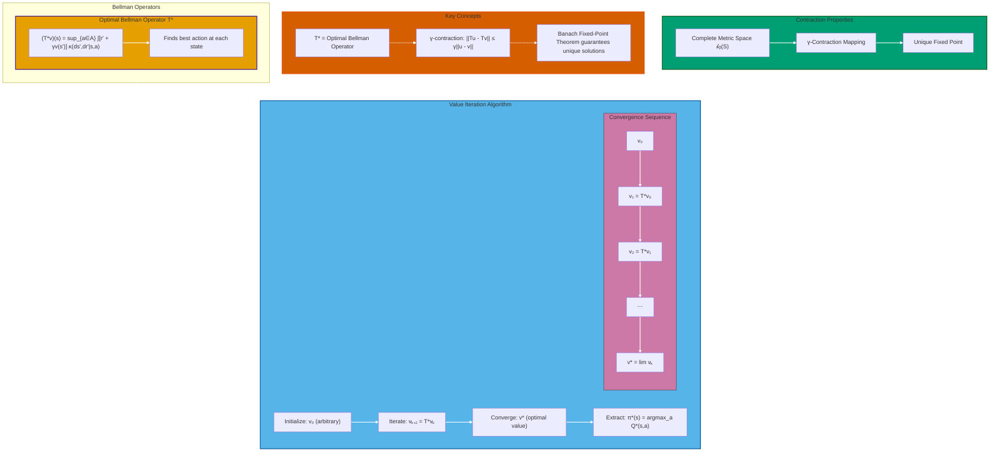
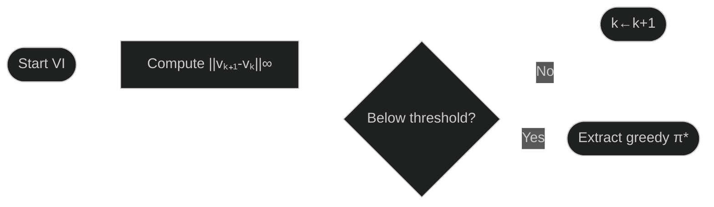
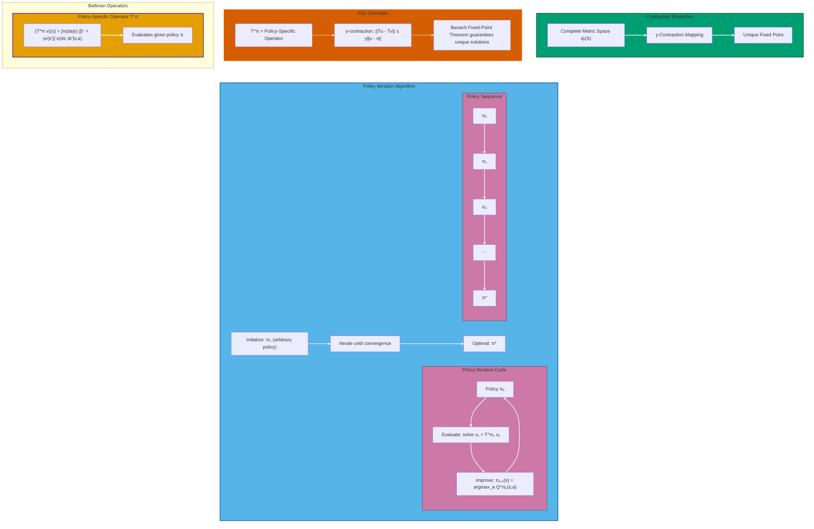
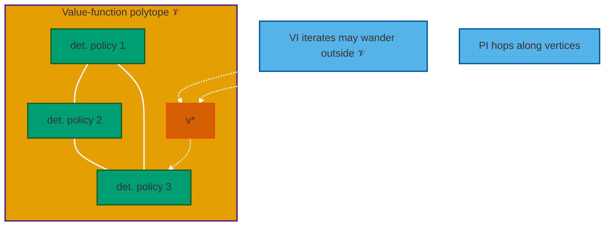

# Exact Solutions: Foundations and Iterative Algorithms

This document details the cornerstone algorithms for finding the optimal value function $v^\ast$ and an optimal policy $\pi^\ast$: **Value Iteration** and **Policy Iteration**. We begin by establishing the rigorous measure-theoretic and functional-analytic framework that guarantees their convergence before analyzing their behavior and complexity.

---

## 1. Mathematical Foundation

Before diving into $\sigma$‑algebras, here’s the **problem we want to solve** in one sentence:

Given any (possibly continuous) MDP, compute a value function that no alternative policy can beat on expected $\gamma$‑discounted return.

Everything that follows shows this is always possible and algorithmically tractable.

### 1.1 Measure-Theoretic Backdrop

All sets below—state space $S$, action space $A$, and the product spaces they generate—are **standard Borel spaces** equipped with their Borel $\sigma$‑algebras.  

Transitions and policies are **probability kernels**; by **Ionescu–Tulcea** every policy induces a unique trajectory measure.  That suffices for the fixed‑point proofs that appear later.

**Why the underlying probability space is irrelevant**:

For any measurable $f$ over trajectories and any two probability spaces $(\Omega,\mathcal F,\mathbb P)$ and $(\Omega',\mathcal F',\mathbb P')$ satisfying the theorem,  

$$
\mathbb E[f(\tau)]=\mathbb E'[f(\tau)].
$$

Hence we may work with the canonical probability space $(\Omega,\mathcal F,\mathbb P)$ induced by the state-action space $S\times A$ of the MDP.

### 1.2 The Value-Function Banach Space

Let $\mathcal{B}_b(S)$ be the space of bounded, measurable functions from states to the reals:

$$ 
\mathcal B_b(S):= \lbrace v:S\to\mathbb R   v \text{ measurable}, \lVert v \rVert_\infty := \sup_{s\in S} \lvert v(s) \rvert <\infty \bigr \rbrace
$$

Equipped with the sup–norm $\lVert \cdot \rVert_\infty$, $\mathcal B_b(S)$ is a **Banach space** (a complete normed vector space). This completeness is a prerequisite for using the Banach fixed-point theorem, which is the engine of our convergence proofs.

### 1.3 Bellman Operators as Contraction Mappings

We define two key operators on the space $\mathcal{B}_b(S)$.

**Optimal Bellman Operator ($T^\ast$)**
With a unified kernel $\kappa(ds',dr'|s,a)$ that gives the joint probability of the next state and reward, we define for every $v\in\mathcal B_b(S)$:
$$ (T^\ast v)(s):=\sup_{a\in A} \int_{S\times\mathbb{R}}\bigl[r'+\gamma v(s')\bigr]\ \kappa(ds',dr'\mid s,a) $$

**Policy-Specific Bellman Expectation Operator ($T^\pi$)**
For any stationary policy kernel $\pi(da|s)$:
$$ (T^\pi v)(s):=\int_A\pi(da|s) \int_{S\times\mathbb{R}}\bigl[r'+\gamma v(s')\bigr] \kappa(ds',dr'\mid s,a) $$

These operators are well-defined and, crucially, are **$\gamma$-contractions** on $\mathcal{B}_b(S)$. For any $u,v\in\mathcal B_b(S)$:

$$ 
\lVert T^\ast u - T^\ast v \rVert_\infty \le \gamma \lVert u-v \rVert_\infty \quad \text{and} \quad \lVert T^\pi u - T^\pi v \rVert_\infty \le \gamma \lVert u-v \rVert_\infty
$$

Because they are contraction mappings on a complete metric space, the **Banach Fixed-Point Theorem** guarantees that each operator has a unique fixed point. The fixed point of $T^\ast$ is the optimal value function $v^\ast$, and the fixed point of $T^\pi$ is the value function of policy $\pi$, $v_\pi$.

---

## 2. Value Iteration (VI)

Value Iteration (VI) computes the optimal state-value function $v^\ast$ by directly implementing the successive application of the Bellman optimality operator, $T^\ast$.

> **Intuition snapshot**: repeatedly *back‑up* future value until numbers stop changing.

**Figure 1 Contraction of the optimal Bellman operator guarantees value‑iteration convergence to the unique optimal value and policy.**

The orange panel defines the *optimal Bellman operator* $T^\ast \bigl[v \bigr] (s) = \sup_{a \in A} \int \bigl[r' + \gamma v(s') \bigr] \kappa(ds',dr'\mid s,a)$, which maps any bounded value function to the best expected return at state $s$.  

The green panel reminds us that $T^\ast$ is a $\gamma$-contraction on the complete metric space $(\mathcal B_{\beta}(S), \lVert \cdot \lVert_\infty)$; hence, by Banach’s fixed‑point theorem it possesses a single fixed point $v^\ast$.  

The blue algorithm panel depicts *value iteration*: starting from an arbitrary $v_0$, the sequence $v_{k+1} = T^\ast v_k$ (violet strip) monotonically approaches $v^\ast$; once converged, the optimal policy is obtained via $\pi^\ast (s)=\arg\max_{a}Q^\ast (s,a)$.  

Red “Key Concepts” boxes summarise these theoretical links, while dashed arrows denote logical dependence and solid arrows procedural flow.  Symbols: $s,s'$–states; $a$–action; $r'$–reward; $\kappa$–transition–reward kernel; $\gamma \in (0,1)$–discount factor; $Q^\ast$–optimal state–action value.  

### 2.1 Algorithm

VI begins with an arbitrary initial value function, $v_0 \in \mathcal B_b(S)$, and generates a sequence of functions $\lbrace v_k \rbrace_{k \in \mathbb N}$ via the update rule:

$$ v_{k+1} \leftarrow T^\ast v_k $$

This is equivalent to the more common form using a separated expected reward $r(s,a)$ and state transition kernel $p(ds' \mid s,a)$:

$$ v_{k+1}(s) = \sup_{a \in A} \left( r(s,a) + \gamma \int_S v_k(s') p(ds' \mid s,a) \right) \quad \forall s \in S $$

### 2.2 Convergence Analysis

The convergence of Value Iteration is a direct and powerful consequence of the **Banach Fixed-Point Theorem**. As established previously:

- The space $(B(S), \lVert \cdot \rVert_\infty)$ is a **complete metric space** (a Banach space). The completeness is essential, as it ensures that the Cauchy sequence generated by the operator converges to a limit *within* the space of bounded, measurable functions.
- The Bellman optimality operator $T^\ast$ is a **$\gamma$-contraction** on this space.

The theorem guarantees that the sequence $v_k$ converges geometrically to the unique fixed point $v^\ast \in \mathcal{B}_b(S)$ regardless of the initial function $v_0$. The error bound is given by:

$$\lVert v_k - v^\ast \rVert_\infty \leq \frac{\gamma^k}{1-\gamma} \lVert v_1 - v_0 \rVert_\infty$$

The following theorem provides a more concrete bound on the number of iterations required to reach an $\epsilon$-neighborhood of $v^\ast$ for a common initialization scenario.

**Theorem (Value Iteration):** Consider an MDP with immediate rewards in the $[0,1]$ interval. Pick an arbitrary positive number $\epsilon > 0$. Let $v_0 = \mathbf{0}$ and set

$$v_{k + 1} = T^\ast v_{k}\quad \mathrm{for}\ k = 0,1,2,\ldots$$

Then, for $k \geq \frac{\ln (1 / (\epsilon (1 - \gamma)))}{\ln (1 / \gamma)}$, we have $\Vert v_k - v^\ast\Vert_\infty \leq \epsilon$. 

**Proof:** By our assumptions on rewards, $\mathbf{0}\leq v^{\pi}\leq \frac{1}{1 - \gamma}\mathbf{1}$ holds for any policy $\pi$. Hence, $\Vert v^\ast \Vert_{\infty}\leq \frac{1}{1 - \gamma}$ also holds. Using the general error bound with $v_0 = \mathbf{0}$, we get:

$$\Vert v_{k} - v^\ast \Vert_{\infty}\leq \gamma^{k} \Vert v^\ast - \mathbf{0} \Vert_{\infty} = \gamma^{k} \Vert v^\ast \Vert_{\infty} \leq \frac{\gamma^{k}}{1 - \gamma}$$

Solving for the smallest $k$ such that $\gamma^k /(1 - \gamma) \leq \epsilon$ gives the result. $\blacksquare$

#### Error Propagation to Control

A key insight from a geometric perspective, formalized by Dadashi et al. (2019), is that the sequence of vectors $v_k$ generated by Value Iteration may not correspond to the value function of any valid policy. The path of the iterates can travel **outside** the space of achievable value functions—the *value-function polytope*—before converging to the optimal value $v^\ast$, which is a vertex on the polytope.

An early–terminated sequence $\lbrace v_k \rbrace$ already yields a near-optimal **greedy** policy
$$
\pi_k(s)=\mathop{\arg\max}\limits_{a\in A}
\Bigl(r(s,a)+\gamma\int_S v_k(s')p(ds'\mid s,a)\Bigr).
$$

The **policy-error bound**
$$
\lVert v^\ast-v_{\pi_k}\rVert_\infty
\le
\frac{2\gamma}{1-\gamma}
\lVert v^\ast-v_k\rVert_\infty
$$

links value accuracy to control accuracy. The theorem is sharp, meaning the constant $\frac{2\gamma}{1-\gamma}$ cannot be generally improved.

**Proof:** 

Let $v$ be an arbitrary value function, $\pi$ be the greedy policy with respect to $v$, and let $\epsilon = \lVert v^\ast - v \rVert_\infty$. We aim to bound the policy error, $\delta = v^\ast - v^{\pi}$.

By the definition of the sup-norm, we have $-\epsilon \mathbf{1} \le v^\ast - v \le \epsilon \mathbf{1}$. The proof proceeds by bounding $\delta$:

$$
\begin{array}{rll}
\delta &= v^\ast - v^{\pi} & \newline
&= T^\ast v^\ast - T_\pi v^\pi & \text{(Bellman equations)} \newline
&\le T^\ast (v + \epsilon \mathbf{1}) - T_\pi v^\pi & \text{(Since } v^\ast \le v + \epsilon\mathbf{1} \text{ and } T^\ast \text{ is monotone)} \newline
&= T^\ast v + \gamma \epsilon \mathbf{1} - T_\pi v^\pi & \text{(Property of Bellman operators)} \newline
&= T_\pi v + \gamma \epsilon \mathbf{1} - T_\pi v^\pi & \text{(Since } \pi \text{ is greedy w.r.t. } v, T_\pi v = T^\ast v) \newline
&\le T_\pi (v^\ast + \epsilon \mathbf{1}) + \gamma \epsilon \mathbf{1} - T_\pi v^\pi & \text{(Since } v \le v^\ast + \epsilon\mathbf{1} \text{ and } T_\pi \text{ is monotone)} \newline
&= T_\pi v^\ast - T_\pi v^\pi + 2\gamma\epsilon\mathbf{1} & \newline
&= \gamma P_\pi(v^\ast - v^\pi) + 2\gamma\epsilon\mathbf{1} & \text{(Definition of } T_\pi) \newline
&= \gamma P_\pi \delta + 2\gamma\epsilon\mathbf{1} &
\end{array}
$$

Rearranging gives $(I - \gamma P_\pi)\delta \le 2\gamma\epsilon\mathbf{1}$. 

The operator $(I - \gamma P_\pi)^{-1} = \sum_{t=0}^\infty (\gamma P_\pi)^t$ is monotone, and for any non-negative vector $z$, $(I - \gamma P_\pi)^{-1}z \le \frac{\lVert z \rVert_\infty}{1-\gamma}\mathbf{1}$. 

Applying this, we get:
$$
\delta \le (I - \gamma P_\pi)^{-1}(2\gamma\epsilon\mathbf{1}) = \frac{2\gamma\epsilon}{1-\gamma}\mathbf{1}
$$

Taking the sup-norm of both sides yields $\lVert \delta \rVert_\infty = \lVert v^\ast - v^\pi \rVert_\infty \le \frac{2\gamma\epsilon}{1-\gamma}$, completing the proof. $\blacksquare$
 
Thus it suffices to stop when the Bellman residual is below $\dfrac{(1-\gamma)\varepsilon}{2\gamma}$ to guarantee an $\varepsilon$-optimal policy.

### Why do we stop? (Stopping Condition and Final Policy)

The algorithm is terminated when the Bellman residual, $\lVert v_{k+1} - v_k \rVert_\infty$, falls below a pre-specified threshold.

Once an adequate approximation of $v^\ast$ is found, a stationary, deterministic optimal policy $\pi^\ast$ can be extracted by acting greedily. 

The existence of a **measurable function** $\pi^\ast: S \to A$ that performs this greedy selection is guaranteed by **measurable selection theorems**, which hinges on the state and action spaces being **Standard Borel**.

With finite precision, **argmax tie-breaking** must be fixed (e.g., lexicographic); otherwise the test “$\pi_{k+1}=\pi_k$” can fail indefinitely even after $v_k$ has converged.  

Moreover, when $\lVert v^\ast\rVert_\infty\ll 1/(1-\gamma)$ an **absolute** residual can be misleading; a **relative** test $\dfrac{\lVert v_{k+1}-v_k\rVert_\infty}{\max(1,\lVert v_{k+1}\rVert_\infty)}$ avoids this pitfall.

This addresses the issue that for an additive error $\epsilon$, the iteration complexity may grow unbounded when $v^\ast$ takes on small values. An absolute error target is less meaningful in such cases.

More formally, to achieve a relative error bound $v^\pi \ge v^\ast - \delta_{\text{rel}} \lVert v^\ast \rVert_\infty \mathbf{1}$, value iteration requires $\tilde{O}\left(\frac{|S|^2|A|}{1-\gamma} \ln\left(\frac{1}{\delta_{\text{rel}}}\right)\right)$ operations.
 

---

## 3. Policy Iteration (PI) - leapfrogging policies

Policy Iteration (PI) is an alternative algorithm that generates a sequence of policies $\{\pi_k\}$, each strictly better than the last, until it converges to the optimal policy $\pi^\ast$. In contrast to Value Iteration, whose runtime depends on the desired precision level $\delta$, Policy Iteration can be shown to find an *exact* optimal policy with a number of operations that is polynomial in the size of the MDP and the effective horizon, a property known as being **strongly polynomial**.

### 3.1 Algorithm

The algorithm alternates between two steps: **Policy Evaluation** and **Policy Improvement**.

1.  **Initialization**: Start with an arbitrary stationary, deterministic policy $\pi_0: S \to A$.

2.  **Iteration**: For $k = 0, 1, 2, \ldots$
    * **Policy Evaluation**: Given policy $\pi_k$, compute its exact state-value function $v_{\pi_k}$. This requires solving the Bellman system of linear equations for $v_{\pi_k}$:
        $$v_{\pi_k} = T^{\pi_k} v_{\pi_k} = r_{\pi_k} + \gamma P_{\pi_k} v_{\pi_k}$$
        This system can be solved explicitly by matrix inversion:
        $$
        v^{\pi_k} = (I - \gamma P_{\pi_k})^{-1}r_{\pi_k}
        $$
        The matrix $I - \gamma P_{\pi_k}$ is guaranteed to be invertible. This can be seen from the von Neumann series expansion $(I - A)^{-1} = \sum_{i=0}^\infty A^i$, which converges whenever all eigenvalues of the matrix $A$ lie strictly within the unit circle on the complex plane. This holds for $A=\gamma P_{\pi_k}$. The computational cost of this step is dominated by the matrix inversion, which is $O(|S|^3)$ using Gaussian elimination or $O(|S|^{2.373})$ with faster algorithms.

    * **Policy Improvement**: Find a new deterministic policy $\pi_{k+1}$ that is **greedy** with respect to $v_{\pi_k}$:
        $$
        \pi_{k+1}(s) = \underset{a \in A}{\arg\max} \left( r(s,a) + \gamma \int_S v_{\pi_k}(s') p(ds' \mid s,a) \right) \quad \forall s \in S
        $$
        The cost of this "greedification" step is $O(|S||A|)$, as it requires checking every action in every state.

3.  **Termination**: The algorithm can be terminated when the policy no longer changes, i.e., $\pi_{k+1} = \pi_k$. To ensure this check works correctly, ties in the `argmax` of the improvement step must be broken consistently (e.g., using a fixed lexicographical order). If $\pi_{k+1} = \pi_k$, then the policy $\pi_k$ is greedy with respect to its own value function, $v_{\pi_k}$, and the **Policy Improvement Theorem** guarantees that it is an optimal policy.

### 3.2 Convergence Analysis

The convergence of PI is guaranteed because the sequence of value functions $\lbrace v_{\pi_k} \rbrace$ is monotonically non-decreasing and bounded above by $v^\ast$. The proof hinges upon two key lemmas.

Geometrically, this monotonic improvement has a clear interpretation. In contrast to Value Iteration, Policy Iteration proceeds by moving from vertex to vertex along the boundary of the value-function polytope. Each **Policy Evaluation** step computes the value of a deterministic policy, which corresponds to a vertex on the polytope, and each **Policy Improvement** step jumps to a new, better-performing vertex.
 
**Lemma 1 (Geometric Progress Lemma):** Let $\pi$ be a policy and $\pi'$ be the policy obtained by acting greedily with respect to $v^\pi$. Then, $v^\pi \le v^{\pi'}$.

**Proof:** By definition of $\pi'$ being greedy, $T^\ast v^\pi = T^{\pi'} v^\pi$. We also know from the definition of the Bellman operator that $v^\pi = T^\pi v^\pi \le T^\ast v^\pi$. Chaining these gives $v^\pi \le T^{\pi'}v^\pi$.

We can prove by induction that $v^\pi \le (T^{\pi'})^i v^\pi$ for all $i \ge 1$. The base case $i=1$ is established. Assuming it holds for $i$, we apply the monotone operator $T^{\pi'}$ to both sides to get $T^{\pi'}v^\pi \le (T^{\pi'})^{i+1}v^\pi$. Combining with the base case yields $v^\pi \le (T^{\pi'})^{i+1}v^\pi$, completing the inductive step.

Taking the limit as $i \to \infty$, we know that $(T^{\pi'})^i v^\pi \to v^{\pi'}$, which proves that $v^\pi \le v^{\pi'}$. $\blacksquare$
 

This monotonicity directly implies that PI converges at a geometric rate.

**Corollary (Geometric Convergence):** 

Let $\lbrace \pi_k \rbrace_{k\geq 0}$ be the sequence of policies from PI. Then for any $k\geq 0$:
 

$$\Vert v_{\pi_k} - v^\ast \Vert_\infty \leq \gamma^k \Vert v_{\pi_0} - v^\ast \Vert_\infty$$

**Proof:** The Geometric Progress Lemma implies $v_{\pi_k} \le v_{\pi_{k+1}}$. Repeated application shows $T^{\ast k} v_{\pi_0} \le v_{\pi_k} \le v^\ast$. From this, it follows that $v^\ast - v_{\pi_k} \le v^\ast - T^{\ast k}v_{\pi_0}$. Taking norms, we get $\lVert v^\ast - v_{\pi_k} \rVert_\infty \le \lVert v^\ast - T^{\ast k}v_{\pi_0} \rVert_\infty = \lVert T^{\ast k}v^\ast - T^{\ast k}v_{\pi_0} \rVert_\infty \le \gamma^k \lVert v^\ast - v_{\pi_0} \rVert_\infty$, where we used that $T^\ast$ is a $\gamma$-contraction. $\blacksquare$

While geometric convergence is guaranteed, a stronger result shows that PI makes strict progress in a finite number of steps by eliminating suboptimal state-action pairs. This relies on the **Value Difference Identity**.

**Lemma 2 (Value Difference Identity):** For any two policies $\pi$ and $\pi'$, the difference in their value functions can be written as:
$$v^{\pi'} - v^{\pi} = (I - \gamma P_{\pi'})^{-1} \left( T^{\pi'}v^{\pi} - v^{\pi} \right)$$
The term $T^{\pi'}v^{\pi} - v^{\pi}$ is the **advantage** of policy $\pi'$ over $\pi$. This identity shows that the value difference is a discounted sum of future advantages. From this, one can prove the following lemma.

**Lemma (Strict Progress Lemma):** After a number of iterations polynomial in $|S|$, $|A|$, and $1/(1-\gamma)$, Policy Iteration is guaranteed to eliminate at least one suboptimal action at some state.

**Proof sketch:** 

Let $\pi^\ast$ be an optimal policy. 

The advantage of $\pi_k$ relative to $\pi^\ast$ is $g(\pi_k, \pi^\ast) = T^{\pi_k}v^{\pi^\ast} - v^{\pi^\ast}$, which is non-positive. 

Using the Value Difference Identity and the Geometric Convergence corollary, one can show that $\lVert g(\pi_k, \pi^\ast)\rVert_\infty \le \frac{\gamma^k}{1-\gamma} \lVert g(\pi_0, \pi^\ast) \rVert_\infty$. 

For a large enough $k$, this implies that for the state $s_0$ with the initially largest advantage gap, the advantage at iteration $k$ becomes strictly smaller: $-g(\pi_k, \pi^\ast)(s_0) < -g(\pi_0, \pi^\ast)(s_0)$. 

This can only happen if the action has changed, i.e., $\pi_k(s_0) \neq \pi_0(s_0)$. This proves that a suboptimal action choice is eventually eliminated. $\blacksquare$
 

This leads to the main runtime result for Policy Iteration.

**Theorem 1 (Runtime Bound for Policy Iteration):** For a finite MDP, Policy Iteration finds an optimal policy in a number of iterations that is polynomial in $|S|$, $|A|$, and $1/(1-\gamma)$. The total complexity is at most $\tilde{O}\left(\frac{|S|^2|A|}{1 - \gamma} \log\frac{|S|}{1-\gamma}\right)$ operations.

As an immediate corollary of the strict progress lemma, since there are at most $|S|(|A|-1)$ suboptimal state-action pairs to eliminate, the algorithm terminates in a number of iterations that is polynomial in $|S|$ and $|A|$.

---

## 4. Geometry of value functions (why algorithms behave as they do)

An alternative way of seeing the fundamental theorem of dynamic programming is as a result concerning the geometry of the space of value functions. For a given MDP, let $\mathcal{V}$ be the set of all attainable value functions and $\mathcal{V}^{\text{DET}}$ be the subset corresponding to deterministic, memoryless policies:

$$
\mathcal V = \left\lbrace v^{\pi} : \pi \text{ is a policy of } M \right\rbrace \subseteq \mathbb{R}^{\lvert S \rvert} 
$$

$$
\mathcal V^{\mathrm{DET}} = \left\lbrace v^{\pi} : \pi \text{ is a deterministic memoryless policy of } M \right\rbrace \subseteq \mathcal V
$$

The behavior of these algorithms is best understood by analyzing the geometric structure of the space of value functions, $\mathcal{V} = \lbrace v^{\pi} \mid \pi \in \text{Policies} \rbrace$. The work of Dadashi et al. (2019) provides a rigorous characterization of this space for finite MDPs.

### 4.1 The value‑function polytope (visual)

Note: "det. policy 1", "det. policy 2", etc. refer to **deterministic policies**. 

In the context of this value-function polytope diagram:

- **Deterministic policies** are policies that always choose a specific action for each state (no randomness)
- Each deterministic policy has a corresponding **value function** that represents the expected returns when following that policy
- The **polytope 𝒱** is the convex hull formed by all possible value functions of deterministic policies
- The **vertices** of this polytope correspond to the value functions of individual deterministic policies

So "det. policy 1", "det. policy 2", "det. policy 3" represent three different deterministic policies, and their positions in the diagram show where their respective value functions sit as vertices of the polytope.

The key insight the diagram illustrates is:
- **Policy Iteration (PI)** moves along the edges/vertices of this polytope (staying within the convex hull of deterministic policy value functions)
- **Value Iteration (VI)** can iterate through points that lie outside this polytope, potentially exploring value functions that don't correspond to any single deterministic policy
- **$v^\ast$** (the optimal value function) is the target both algorithms converge to.

---

Using terminology from multicriteria optimization, the optimal value function, $v^{\ast}$, is the **ideal point** of $\mathcal{V}$:

$$
v^\ast (s) = \sup \left\lbrace v(s) : v \in \mathcal V  \right\rbrace , \quad \forall s \in S
$$

The fundamental theorem states that this ideal point belongs to the set, and more specifically, it is achievable by a deterministic policy: $v^{\ast}\in\mathcal{V}^{\text{DET}}$. Work by Dadashi et al. (2019) formalizes the structure of this space:

> **Theorem (Existence)**
> For a finite MDP, the space of attainable value functions $\mathcal{V}\subset\mathbb{R}^{|S|}$ is a convex polytope. Its extreme points (vertices) are a subset of the value functions for deterministic policies, $\mathcal{V}^{\text{DET}}$.
 

This polytope structure provides key geometric insights we can rely on:
* **Line Theorem**: If two policies differ at exactly one state $s$, the set of values traced by varying the policy *only* at that state forms a monotone line segment within $\mathcal{V}$. The endpoints of this segment correspond to the values of the two underlying deterministic policies for that state.
* **Boundary via Semi-Determinism**: A value function $v_\pi$ lies on the boundary of the polytope, $\partial\mathcal{V}$, if and only if the policy $\pi$ that generates it is deterministic in at least one state.

### 4.2 Hyperplane-Arrangement View [^WuDeLoera22]

Writing the Bellman equalities for all state-action pairs produces the arrangement

$$H_{\text{MDP}} = \left\lbrace v(s) = r(s,a) + \gamma \sum_{s'} P(s' \mid s,a) v(s') \bigg\lvert s \in S, a \in A \right\rbrace$$

whose **$\lvert S \rvert \lvert A \rvert$ hyperplanes exactly support $\partial\mathcal{V}$**.

Full-dimensional cells of $\mathcal{V}$ are unions of cells of $H_{\text{MDP}}$, giving an explicit link between the "value" polytope and the classical LP feasible polytope.

### 4.3 Algorithmic Dynamics Revisited

**Value Iteration** may step **outside** $\mathcal{V}$, as its iterates are not guaranteed to be the value of any specific policy. It then converges towards the optimal vertex, often moving along the $(1,1,\ldots)$ direction, which explains its sometimes slow progress near $\gamma \to 1$.

**Policy Iteration** walks from vertex to vertex *on the boundary* of $\mathcal{V}$; each sweep follows a path composed of at most $\lvert S \rvert$ monotone segments guaranteed by the Line Theorem.

---

### 4.4 The Occupancy Measure Formulation

An alternative approach to solving for an optimal policy recasts the optimization problem in terms of **discounted occupancy measures**. This powerful technique transforms the non-linear problem of optimizing over policy parameters into a linear problem over a convex set of measures, making it solvable with standard linear programming.

The discounted state-action occupancy measure $\nu_{\pi,\mu}(s,a)$ for a policy $\pi$ and initial state distribution $\mu$ is the total discounted probability of visiting state-action pair $(s,a)$:

$$
\nu_{\pi,\mu}(s,a) := \sum_{t=0}^{\infty} \gamma^{t} \Pr_{\pi,\mu}[S_t = s, A_t = a]
$$

Crucially, the expected discounted return (the value function) can be expressed as a simple inner product of the occupancy measure and the reward vector:
$$
v_{\pi}(\mu) = \sum_{s,a} r(s,a)\nu_{\pi,\mu}(s,a) = \langle \nu_{\pi,\mu}, r \rangle
$$

This insight is key: while the value function is generally a complex, non-linear function of the policy parameters, it is a **linear function** of the corresponding occupancy measures. Since the set of valid occupancy measures is a convex polytope, finding the optimal policy is equivalent to solving a linear program over this polytope.

#### Example

Consider an MDP with state-action spaces:
- $S = \{s_1,s_2\}$
- $A(s_1) = \{a_1,a_2\}$, $A(s_2) = \{a_3\}$

**Dynamics and Rewards:**
- $P(s_1 | s_1, a_1) = 1$, with reward $r(s_1, a_1) = 1$
- $P(s_2 | s_1, a_2) = 1$, with reward $r(s_1, a_2) = 0.5$
- $P(s_2 | s_2, a_3) = 1$, with reward $r(s_2, a_3) = 0.5$

**Policy Parameterization:**
Let the policy be stochastic in state $s_1$, parameterized by $p \in [0,1]$:
- $\pi(a_1|s_1)=p$
- $\pi(a_2|s_1)=1-p$
- $\pi(a_3|s_2)=1$

Assume the initial distribution is $\mu(s_1)=1$.

**Discounted Occupancy Measures:**
The occupancy measures can be calculated as follows:
- $\nu_{\pi,\mu}(s_1,a_1) = \sum_{t=0}^{\infty} \gamma^{t} p^{t+1} = p\sum_{t=0}^{\infty} (\gamma p)^t = \frac{p}{1-\gamma p}$
- $\nu_{\pi,\mu}(s_1,a_2) = \sum_{t=0}^{\infty} \gamma^{t} p^{t}(1-p) = (1-p)\sum_{t=0}^{\infty} (\gamma p)^t = \frac{1-p}{1-\gamma p}$
- $\nu_{\pi,\mu}(s_2,a_3) = \frac{1}{1-\gamma} - \frac{p}{1-\gamma p} - \frac{1-p}{1-\gamma p}$

**Expected Discounted Return:**

The total expected return is the linear combination of rewards and their corresponding occupancies:
$$
v_\pi(\mu) = (1) \cdot \frac{p}{1-\gamma p} + (0.5) \cdot \frac{1-p}{1-\gamma p} + (0.5) \cdot \left(\frac{1}{1-\gamma} - \frac{p}{1-\gamma p} - \frac{1-p}{1-\gamma p}\right)
$$

This expression simplifies to a form that is monotonically increasing in $p \in [0,1]$. Therefore, the value is maximized at $p^\star = 1$.

**Optimal Policy:**

The optimal policy is the deterministic policy corresponding to $p=1$:
$$
\pi^\star(a_1|s_1)=1, \quad \pi^\star(a_2|s_1)=0, \quad \pi^\star(a_3|s_2)=1
$$

This matches the intuition that one should always choose the action with the higher immediate reward in state $s_1$. The example demonstrates how reframing the problem in terms of occupancy measures linearizes the optimization.

---

## 5. Advanced and Geometric Variants

This geometric insight motivates more advanced algorithms that exploit the polytope's structure.

### 5.1 Geometric Policy Iteration (GPI)

1. **Policy update rule**: Choose state $s$ with maximal advantage; jump *directly* to the *endpoint* of its line segment (closed-form via Sherman-Morrison rank-1 update).

2. **Immediate value refresh**: After each state update, recompute all $v(s')$ in $O(\lvert S \rvert^2 \lvert A \rvert)$ using the same rank-1 trick.

**Theorem (GPI complexity)**: With fixed discount $\gamma$, GPI terminates in
$$O\left(\frac{\lvert A \rvert}{1-\gamma} \log \frac{1}{1-\gamma}\right)$$
iterations — matching the best known strongly-polynomial bound for PI [^WuDeLoera22].

### 5.2 Modified Policy Iteration (MPI)

- **Value Iteration** takes incremental steps toward the optimal value function $v^\ast$. Its path of iterates can go *outside* the value function polytope, meaning intermediate value vectors may not be achievable by any policy.

- **Policy Iteration** navigates by jumping between vertices of the value function polytope that correspond to deterministic policies. The **Policy Evaluation** step identifies a vertex, and the **Policy Improvement** step moves to a better vertex. However, this jump does not always reach the endpoint of a line segment, which represents a potential inefficiency.

- **Geometric Policy Iteration (GPI)** is a more advanced algorithm that directly addresses PI's inefficiency. By efficiently calculating the true value improvement for each potential action switch, GPI guarantees that each update moves to an endpoint of a line segment in the polytope. This makes the value function monotonically increasing with respect to *every action switch*, not just every full iteration.

---

MPI interpolates between VI ($m=1$ sweep) and PI ($m=\infty$) by
performing $m$ applications of $T^{\pi_k}$ before each improvement.
Despite strong empirical performance, Scherrer [^Scherrer14] proves **MPI is not strongly-polynomial**: for fixed $m$ there exist MDP families where the iteration count grows exponentially in $\lvert S\rvert$.

#### Complexity

*Per-iteration cost* mirrors VI for small $m$ and PI for large $m$,
yet the *number of iterations* can explode, highlighting a trade-off
between computational and convergence efficiency.

---

## 6. Comparison and Runtime Bounds

| Feature | Value Iteration (VI) | Policy Iteration (PI) | Geometric Policy Iteration (GPI) |
|---------|---------------------|----------------------|----------------------------------|
| **Cost per Iteration** | Lower. One sweep over the state space, costing $O(\lvert S \rvert^2 \lvert A \rvert)$ in the finite case. | Higher. Policy evaluation requires solving a system of $\lvert S \rvert$ linear equations, often $O(\lvert S \rvert^3)$. | Same as PI, $O(\lvert S \rvert^2 \lvert A \rvert)$ per iteration, by using efficient rank-1 updates (Sherman-Morrison formula). |
| **Number of Iterations** | Can be large, especially for $\gamma \approx 1$. | Finite, often small in practice. The best known bound is $O\left(\frac{\lvert \mathcal{A} \rvert}{1-\gamma}\log\frac{1}{1-\gamma}\right)$. | Fewer than PI in practice. Achieves the same theoretical bound as PI: $O\left(\frac{\lvert \mathcal{A} \rvert}{1-\gamma}\log\frac{1}{1-\gamma}\right)$. |
| **Convergence** | Converges to $v^\ast$ in the limit. Path can go outside the value function polytope. | Converges to $\pi^\ast$ by moving between vertices of the polytope. Value is not strictly monotone per action switch. | Converges to $\pi^\ast$ by jumping to endpoints of line segments. Value is non-decreasing with every action switch. |
| **Implementation** | Simpler; direct application of the $T^\ast$ operator. | Requires solving $(I-\gamma P_\pi)^{-1}$ — $O(\lvert S\rvert^3)$ naively, $O(\lvert S\rvert^{2.37})$ with fast matrix multiplication, or $O(\lvert S\rvert^2)$ via Sherman–Morrison after a single-state switch; deterministic tie-breaking is mandatory. | More complex than PI, requiring efficient calculation of value updates and matrix inverses. |

### 6.1 Runtime Summary (Finite Case)

* **Value Iteration**: VI is **not strongly-polynomial**. This means its runtime to find an *exact* optimal policy cannot be bounded by a polynomial in $|S|$, $|A|$, and $1/(1-\gamma)$. There exists a simple 3-state MDP where, by tuning a reward parameter $R$, the number of iterations required for VI to identify the optimal action can be made arbitrarily large.
    * **Proof Sketch:** Consider an MDP with states $s_0, s_1, s_2$. From $s_1$, action $a_0$ goes to $s_2$ (reward 0) and $a_1$ goes to $s_0$ (reward $R$). From $s_2$, a single action leads back to $s_2$ (reward 1). The optimal action at $s_1$ is $a_0$ if its value, $\gamma v^\ast(s_2) = \frac{\gamma}{1-\gamma}$, is greater than the value from $a_1$, which is $R$. VI initialized at $v_0 = \mathbf{0}$ computes iterates $v_k(s_2) = \frac{\gamma(1-\gamma^k)}{1-\gamma}$. VI will incorrectly prefer action $a_1$ as long as $R > v_k(s_2)$. By choosing $R$ to be a value between $v_k(s_2)$ and $v^\ast(s_2)$ for a large $k$, one can force VI to take an arbitrarily large number of iterations to converge to the optimal policy at state $s_1$.

This example is due to Feinberg, Huang, and Scherrer (2014). Any algorithm guaranteed to find a $\delta$-optimal policy (for $\delta < \gamma/(1-\gamma)$) must perform at least $\Omega(|S|^2|A|)$ operations in the worst case. We construct a family of deterministic MDPs where identifying the optimal policy requires examining a large portion of the transition table.

* Partition the state space $S$ into three equal sets: a "hell" set, a "heaven" set, and a "choice" set $R$.
* In "heaven" states, all actions self-loop with a reward of 1, yielding a value of $v(s) = 1/(1-\gamma)$.
* In "hell" states, all actions self-loop with a reward of 0, yielding a value of $v(s) = 0$.
* For each state $s \in R$, all actions but one lead to a "hell" state. One unique "needle-in-a-haystack" action, $a^\ast_s$, leads to a "heaven" state.
The optimal value for any state in $R$ is $\gamma/(1-\gamma)$, achieved only by picking the action $a^\ast_s$. Any other action yields a value of 0. An algorithm that is $\delta$-optimal must find the special action $a^\ast_s$ for each state $s \in R$, as the value gap is $\gamma/(1-\gamma) > \delta$.
To find the unique transition to heaven for a given state in $R$, the algorithm must read the transition table entries. In the worst case, it must check all $|A|$ actions. Since there are $|S|/3 = \Omega(|S|)$ states in $R$, the total number of operations is at least $\Omega(|S||A|)$. $\blacksquare$
    * For finding an **$\varepsilon$-optimal policy**, however, VI's complexity is well-behaved: $\tilde{O}\left(\frac{|S|^2|A|}{(1-\gamma)^2} \ln \frac{1}{\varepsilon}\right)$ operations are sufficient.

* **Policy Iteration (Howard)**: PI **is strongly polynomial**. It finds an *exact* optimal policy with a complexity of $O\left(\frac{|S|^2|A|}{1-\gamma} \log \frac{|S|}{1-\gamma}\right)$ operations in the worst case. In practice, the number of iterations is often very small.

* **Geometric Policy Iteration**: GPI is also strongly polynomial and achieves a similar theoretical bound to PI, often with fewer iterations in practice.

The practical takeaway is that while VI may seem inferior due to its theoretical limitations for exact computation, its simplicity and lower per-iteration cost make it highly effective for finding approximately optimal policies, which is often sufficient. PI's strength lies in its ability to "snap" to the exact solution in a reliably finite (and often small) number of steps.

### 6.2 Practical Implications: Exact vs. Approximate Optimality

The fact that Policy Iteration is strongly polynomial while Value Iteration is not raises a crucial question: is VI an inferior algorithm?. While PI can "snap" to the exact optimal policy in a finite number of steps, VI's runtime to do so can be infinite for certain MDPs.

However, in many practical applications, the need for *exact* optimality is debatable. Models of the environment are themselves approximations, and solutions will often be implemented in settings with inherent noise and uncertainty (e.g., through sampling). In this context, an approximately optimal policy is often sufficient. VI's guarantee to find an $\varepsilon$-optimal policy with complexity that scales well (e.g., logarithmically with $1/\varepsilon$) is highly valuable.

The choice between them is therefore a trade-off: PI offers faster theoretical convergence to an exact solution, while VI provides a simpler, often efficient path to an approximately optimal one.

## 7. Historical Notes and Context

* **Value Iteration:** The core idea of using successive approximations of the value function is generally attributed to **Richard Bellman's** work on dynamic programming in the 1950s.
 
* **Policy Error Bound:** The crucial bound linking the error of a value function to the suboptimality of its greedy policy (Section 2.2) was formalized by **Singh & Yee (1994)**.
    * **On the Tightness of the Bound:** The constant $2\gamma/(1-\gamma)$ is sharp. This can be shown with a 2-state MDP where one action always leads to state A (with reward $2\gamma\epsilon$) and another action always leads to state B (reward 0). By constructing a value function $v$ that underestimates $v^\ast(A)$ by $\epsilon$ and overestimates $v^\ast(B)$ by $\epsilon$, the greedy policy can be made to choose the action leading to state B, resulting in a value of 0. This matches the bound's prediction.
 
* **Complexity Lower Bound:** The $\Omega(|S|^2|A|)$ computational lower bound for planning in tabular MDPs (Section 6.1) is from **Chen & Wang (2017)**. Their work highlights that without structural assumptions, the complexity of planning is fundamentally tied to the size of the state-action space.
 
* **The Importance of Input Representation:** The complexity bounds discussed assume a tabular representation where transition probabilities $P(s'|s,a)$ are listed explicitly. The lower bound argument relies on the difficulty of finding the one optimal action among $|A|$ choices for each of the $|S|$ states. Alternative representations can fundamentally change the runtime:
    * A **simulator model (or generative model)**, which returns a sampled next state and reward for a given state-action pair, is another common assumption.
    * Using a **cumulative probability distribution** for transitions, i.e., representing $[P(s_1|s,a), P(s_1|s,a)+P(s_2|s,a), \dots, 1]$, allows the "needle-in-the-haystack" problem from the lower bound proof to be solved in $O(\log S)$ time via binary search, potentially reducing complexity.
 
---

## References

[^ChenWang17]: Y. Chen & M. Wang, "Lower bound on the computational complexity of discounted markov decision problems", *arXiv* 2017.
 
[^Dadashi19]: R. Dadashi *et al.*, "The Value-Function Polytope in Reinforcement Learning", ICML 2019.

[^WuDeLoera22]: Y. Wu & J. A. De Loera, "Geometric Policy Iteration for Markov Decision Processes", KDD 2022.

[^Ye11]: Y. Ye, "The Simplex and Policy-Iteration Methods Are Strongly Polynomial…", *Math. Oper. Res.* 2011.

[^Puterman94]: M. L. Puterman, *Markov Decision Processes: Discrete Stochastic
  Dynamic Programming*, Wiley 1994. 

[^SinghYee94]: S. P. Singh & R. C. Yee, "An upper bound on the loss from approximate optimal-value functions", *Machine Learning* 1994.

