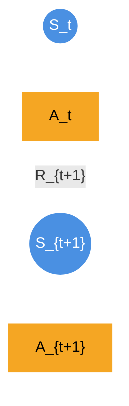
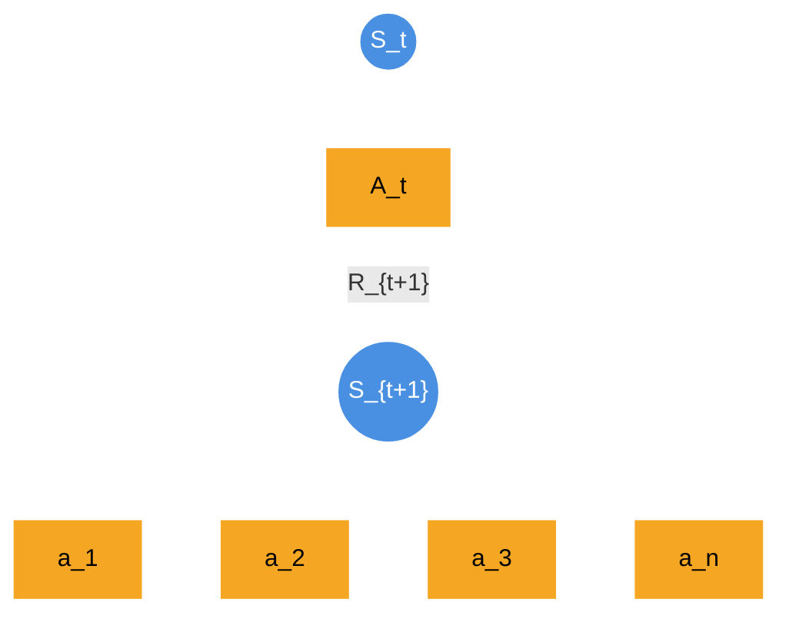

# 1 Motivation for Learning from Experience

Learning from experience means learning from sample sequences of states, actions, and rewards from actual or simulated interaction with an environment, rather than from a complete description of the environment's dynamics (transition probabilities, reward distributions, etc.).

The power of experience-based learning lies in two key advantages:
- **Learning from actual experience** requires no prior knowledge of environment dynamics, yet can still achieve optimal behavior
- **Learning from simulated experience** only needs a model that can generate sample transitions, not complete probability distributions of all possible transitions

In many cases, it is easy to generate experience sampled according to desired probability distributions, but infeasible to obtain the distributions in explicit form. The simplest forms of these interactions are realizations of random trajectories $(X_t, A_t, R_t)_{t \geq 0}$.

Learning from experience is a powerful paradigm because it frees us from needing a complete description of the environment—an often impractical requirement. It also enables incremental algorithms whose runtime does not depend on the size of the environment and that can easily be implemented and parallelized.

In reinforcement learning, we seek to find an optimal policy $\pi^*$ that maximizes the expected return:

$$
J(\pi) = \mathbb E_{\pi}\left[\sum_{t=0}^{\infty} \gamma^t R_{t+1} \mid S_0 = s\right]
$$

where $\gamma \in [0,1]$ is the discount factor, $R_{t+1}$ is the reward at time $t+1$, and the expectation is taken over trajectories generated by policy $\pi$.

## 1.1 Why Traditional Dynamic Programming Falls Short

#### Complete Model Requirement
Dynamic programming methods (like value iteration or policy iteration) require complete knowledge of the environment's dynamics:
- Transition probabilities: $P(s' \mid s, a) = \Pr[S_{t+1} = s' \mid S_t = s, A_t = a]$
- Reward function: $R(s, a, s') = \mathbb{E}[R_{t+1} \mid S_t = s, A_t = a, S_{t+1} = s']$

### Computational Complexity
The Bellman equation for the state-value function requires summing over all possible next states:

$$V^{\pi}(s) = \sum_{a} \pi(a \mid s) \sum_{s'} P(s' \mid s, a) [R(s, a, s') + \gamma V^{\pi}(s')]$$

This becomes computationally intractable when:
- The state space $|\mathcal{S}|$ is large
- The action space $|\mathcal{A}|$ is large
- We don't have explicit access to $P(s' \mid s, a)$

## 1.2 The Experience-Based Alternative

The fundamental insight underlying experience-based learning is that we can replace exact expectations $\mathbb E [X]$ (intractable) with sample averages $\frac{1}{N} \sum_{i=1}^N X_i$ (tractable).

Instead of computing exact expectations, we use sample trajectories $\{(S_t, A_t, R_{t+1})\}_{t=0}^{T}$ to estimate:

$$
V^{\pi}(s) \approx \frac{1}{N} \sum_{i=1}^{N} G_t^{(i)}
$$

where $G_t^{(i)} = \sum_{k=0}^{\infty} \gamma^k R_{t+k+1}^{(i)}$ is the return from the $i$-th sample trajectory.

### Monte Carlo Estimation
By the Strong Law of Large Numbers, as $N \to \infty$:

$$
\frac{1}{N} \sum_{i=1}^{N} G_t^{(i)} \to \mathbb E_{\pi}[G_t \mid S_t = s] = V^{\pi}(s)
$$

with probability 1.

### Temporal Difference Learning
We can further improve efficiency by bootstrapping from current estimates:

$$V(S_t) \leftarrow V(S_t) + \alpha [R_{t+1} + \gamma V(S_{t+1}) - V(S_t)]$$

The TD error $\delta_t = R_{t+1} + \gamma V(S_{t+1}) - V(S_t)$ provides an unbiased estimate of the update direction.

### Mathematical Advantages of Experience-Based Learning

1. Convergence without Complete Knowledge
The Robbins-Monro theorem guarantees convergence of stochastic approximation methods when:
- $\sum_{t=1}^{\infty} \alpha_t = \infty$ (infinite learning)
- $\sum_{t=1}^{\infty} \alpha_t^2 < \infty$ (decreasing step sizes)

**2. Computational Efficiency**

- **Space complexity**: $O(|\mathcal{S}|)$ instead of $O(|\mathcal{S}|^2 |\mathcal{A}|)$
- **Time complexity per update**: $O(1)$ instead of $O(|\mathcal{S}|)$

**3. Incremental Learning**

Updates can be performed online:
$$V_{t+1}(s) = V_t(s) + \alpha_t [G_t - V_t(s)]$$

This enables continuous learning without storing all past experiences.

**4. Stochastic Approximation**

The update rule approximates the true gradient:

$$
\nabla J(\theta) = \mathbb E_{\pi_{\theta}}[\nabla_{\theta} \log \pi_{\theta}(a \mid s) Q^{\pi_{\theta}}(s, a)]
$$

Using samples $\lbrace (s_t, a_t, r_{t+1}) \rbrace$, we get an unbiased estimator:

$$
\hat{\nabla} J(\theta) = \nabla_{\theta} \log \pi_{\theta}(a_t \mid s_t) Q^{\pi_{\theta}}(s_t, a_t)
$$

## 1.3 Model-Based vs Experience-Based Approaches

### Model-Based Planning: The Traditional Approach

Model-based planning involves learning a model of the environment dynamics and then using that model for planning. The approach has two stages:

**Stage 1: Model Learning**
Learn transition probabilities and rewards:
- $\hat{P}(s' \mid s, a) \approx P(s' \mid s, a)$
- $\hat{R}(s, a) \approx R(s, a)$

**Stage 2: Planning with the Model**
Use dynamic programming on the learned model:
$$V^{\pi}(s) = \sum_{a} \pi(a \mid s) \sum_{s'} \hat{P}(s' \mid s, a) [\hat{R}(s, a) + \gamma V^{\pi}(s')]$$

### Mathematical Challenges with Model-Based Approaches

**1. Sample Complexity for Model Learning**

To learn $\hat{P}(s' \mid s, a)$ accurately, we need sufficient samples for each $(s, a, s')$ triplet. The number of parameters to estimate is $|\mathcal{S}|^2 |\mathcal{A}|$.

**Maximum Likelihood Estimation**:
$$\hat{P}(s' \mid s, a) = \frac{N(s, a, s')}{N(s, a)}$$

where $N(s, a, s')$ is the count of transitions from $s$ to $s'$ under action $a$.

**Confidence Bound**: With probability $1-\delta$, the estimation error is bounded by:
$$|\hat{P}(s' \mid s, a) - P(s' \mid s, a)| \leq \sqrt{\frac{2\log(2|\mathcal{S}||\mathcal{A}|/\delta)}{N(s, a)}}$$

This requires $O(|\mathcal{S}|^2 |\mathcal{A}| \log(|\mathcal{S}||\mathcal{A}|/\delta))$ samples for accurate estimation.

**2. Compound Error Propagation**

Model errors compound through the planning horizon. If the model error at each step is $\epsilon$, the total error over $H$ steps scales as:
$$\text{Planning Error} \approx \frac{\epsilon \gamma (1 - \gamma^H)}{(1 - \gamma)^2}$$

For $\gamma$ close to 1, this grows approximately as $\epsilon H^2$.

**3. Distribution Mismatch**

The learned model $\hat{P}$ may not match the true distribution $P$ where it matters most. Define the **model bias**:
$$\text{Bias}(s, a) = \sum_{s'} |P(s' \mid s, a) - \hat{P}(s' \mid s, a)|$$

The value function error becomes:
$$|V^{\pi}(s) - \hat{V}^{\pi}(s)| \leq \frac{\gamma}{1-\gamma} \max_{s,a} \text{Bias}(s, a)$$

### Why Experience-Based Learning Can Be Superior

**1. Direct Policy Optimization**

Experience-based methods directly optimize the policy without an intermediate model:

$$
\theta_{t+1} = \theta_t + \alpha \nabla_{\theta} \mathbb E_{\pi_{\theta}}[G_t]
$$

Using the policy gradient theorem:

$$
\nabla_{\theta} J(\theta) = \mathbb E_{\pi_{\theta}}[\nabla_{\theta} \log \pi_{\theta}(a \mid s) Q^{\pi_{\theta}}(s, a)]
$$

**Key advantage**: No compound error from imperfect models.

**2. Robustness to Model Misspecification**

Consider a model-free Q-learning update:

$$
Q(s, a) \leftarrow Q(s, a) + \alpha [R + \gamma \max_{a'} Q(s', a') - Q(s, a)]
$$

This converges to $Q^*$ even when:
- The environment is non-stationary
- The function approximation is imperfect
- The exploration strategy is suboptimal

**3. Sample Efficiency in High-Dimensional Spaces**

For function approximation with parameters $\theta$:
$$Q(s, a; \theta) \approx Q^*(s, a)$$

**Model-based**: Need to learn $\hat{P}(s' \mid s, a)$ for all $(s, a, s')$ triplets
**Model-free**: Only need to learn $Q(s, a)$ for visited $(s, a)$ pairs

When $|\mathcal{S}|$ is large, this difference is substantial.

### Theoretical Sample Complexity Comparison

**Model-Based Sample Complexity**
For $\epsilon$-optimal policy with probability $1-\delta$:
$$N_{\text{model-based}} = \tilde{O}\left(\frac{|\mathcal{S}|^2 |\mathcal{A}|}{(1-\gamma)^3 \epsilon^2}\right)$$

**Model-Free Sample Complexity**
For the same guarantee:
$$N_{\text{model-free}} = \tilde{O}\left(\frac{|\mathcal{S}||\mathcal{A}|}{(1-\gamma)^4 \epsilon^2}\right)$$

**Key insight**: Model-free scales with $|\mathcal{S}|$ while model-based scales with $|\mathcal{S}|^2$.

### When Model-Based Planning Fails

**1. Partial Observability**

When state $s_t$ is not fully observable, model learning becomes:
$$P(o_{t+1} \mid h_t, a_t) \text{ instead of } P(s_{t+1} \mid s_t, a_t)$$

where $h_t$ is the history and $o_t$ is the observation.

**2. Continuous State/Action Spaces**

Model learning requires function approximation:
$$\hat{P}(s' \mid s, a; \phi) \approx P(s' \mid s, a)$$

This introduces additional approximation errors that compound during planning.

**3. Adversarial or Non-Stationary Environments**

When $P(s' \mid s, a)$ changes over time, learned models quickly become obsolete.

### The Experience Advantage

The fundamental mathematical advantage of experience-based learning is the direct optimization of the targeted objective $\max_{\pi} J(\pi)$ versus model-based surrogates $\max_{\pi} \hat{J}(\pi; \hat{P})$, where $\hat{J}(\pi; \hat{P})$ is the objective under the learned model.

## Conclusion

Experience-based learning is a powerful paradigm that frees us from needing a complete description of the environment—an often impractical requirement. By avoiding the intermediate step of model learning, experience-based methods reduce total approximation error and often lead to better sample efficiency in complex environments.

The key advantages include:
- **No prior knowledge required**: Can achieve optimal behavior without knowing environment dynamics
- **Computational efficiency**: Runtime independent of environment size
- **Robustness**: Less sensitive to model misspecification and non-stationarity
- **Scalability**: Better sample complexity in high-dimensional spaces

Experience-based learning enables incremental algorithms that can be easily implemented and parallelized, making it a practical and powerful approach for real-world reinforcement learning problems.

---

# 2 Monte Carlo Methods

**Monte Carlo (MC) methods** represent a class of computational algorithms that leverage repeated random sampling to obtain numerical estimates of deterministic quantities. 

In the context of reinforcement learning, these methods are used to **estimate value functions by averaging the empirical returns** obtained from complete, simulated episodes of agent-environment interaction. 

A key characteristic of MC methods is that they operate on a **model-free** basis, meaning they do not require any knowledge of the environment's transition kernel $\kappa(ds'dr'|s, a)$.

While the Bellman equation provides a way to solve for a policy's value function using dynamic programming, it requires a model of the environment (the transition kernel $p$ and reward function $r$). 

**Monte Carlo (MC) methods** offer a model-free alternative for policy evaluation. They estimate the value function by directly averaging the empirical returns from sample trajectories generated by interacting with the environment.

## 2.1 The Monte Carlo Principle

The theoretical foundation of Monte Carlo estimation lies in two fundamental results from probability theory: the Law of Large Numbers and the Central Limit Theorem.

The underlying principle is the **Law of Large Numbers**. To estimate the expected value of a random variable, one can generate independent and identically distributed (i.i.d.) samples of that variable and compute their sample mean. As the number of samples grows, this average converges almost surely to the true expectation.

### Formal Definition of Monte Carlo Estimation

Formally, let $(\Omega, \mathcal{F}, \mathbb P)$ be a probability space and let $X: \Omega \to E$ be a random variable. 

Suppose we wish to estimate the expected value of a real-valued function of this random variable, $g(X)$, where $g: E \to \mathbb R$ is a measurable function. 

The quantity to be estimated is the expectation, defined by the Lebesgue integral:

$$
\mu := \mathbb E [g(X)] = \int_{\Omega} g(X(\omega)) d \mathbb P (\omega)
$$

Alternatively, let $Z$ be a real-valued random variable defined on a probability space $(\Omega, \mathcal{F}, \mathbb P)$. 

Its expectation is given by the Lebesgue integral:

$$
\mu := \mathbb E [Z] = \int_{\Omega} Z(\omega) d\mathbb P (\omega)
$$

When this integral is analytically or computationally intractable, the Monte Carlo method provides a means of approximation. The procedure is as follows:

1. **Sampling**: 
  * Generate a sequence of $K$ independent and identically distributed (i.i.d.) samples, $\lbrace X_1, X_2, \dots, X_K \rbrace$, from the distribution of $X$. 
  * Alternatively, generate $K$ independent samples $\omega_1, \dots, \omega_K$ from the probability space, yielding $K$ i.i.d. realizations of the random variable, $Z_k = Z(\omega_k)$.

2. **Estimation**: 
  * Compute the sample mean of $g$ applied to these samples. This sample mean serves as the estimator for $\mu$:
   $$\hat \mu_K = \frac{1}{K} \sum_{k=1}^{K} g(X_k)$$
  * Or equivalently, form the sample mean estimator:
   $$\hat \mu_K = \frac{1}{K} \sum_{k=1}^K Z_k$$

### Theoretical Guarantees

The **Strong Law of Large Numbers** guarantees that this estimator converges to the true mean with probability $1$ as the number of samples increases:

$$
\hat \mu_K \xrightarrow{a.s.} \mu \quad \text{as} \quad K \to \infty
$$

By the **Strong Law of Large Numbers**, this estimator is strongly consistent, meaning $\hat{\mu}_K \to \mu$ almost surely (a.s) as $K \to \infty$.

Furthermore, if the variance of $g(X)$ is finite ($\sigma^2 = \text{Var}[g(X)] < \infty$), or more generally, if the variance of $Z$ is finite ($\text{Var}[Z] < \infty$), the **Central Limit Theorem** characterizes the asymptotic distribution of the estimation error, stating that $\sqrt{K}(\hat{\mu}_K - \mu)$ converges in distribution to a normal distribution with mean $0$ and variance $\sigma^2$:

$$
\sqrt{K}(\hat{\mu}_K - \mu) \xrightarrow{d} \mathcal{N}(0, \sigma^2)
$$

This provides a measure of the uncertainty in the estimate and allows for the construction of confidence intervals around the estimate.

## 2.2 Monte Carlo Policy Evaluation

In reinforcement learning, this principle is directly applied to the problem of **policy evaluation**, which is the task of estimating the state-value function $v_\pi$ or the action-value function $q_\pi$ for a fixed policy $\pi$.

### Estimating the State-Value Function $v_\pi$

Recall that the state-value function $v_\pi: S \to \mathbb{R}$ of a policy $\pi$ is the expected discounted regurn given that the process starts in state $s$:

$$
v_\pi(s) := \mathbb E_{\pi} \left[ G_t \mid S_t = s \right] = \mathbb E_{\pi} \left[ \sum_{k=0}^{\infty} \gamma^k R_{t+k+1} \mid S_t = s \right]
$$

This expectation is taken with respect to the process measure $\mathbb{P}_\mu^\pi$ defined over the space of all possible trajectories. An MC method estimates this value by executing the policy $\pi$ to generate sample trajectories (or "episodes") and averaging the returns observed for each state.

**Important Note**: This approach is only applicable to **episodic tasks**, where interaction eventually terminates, ensuring that a finite return can be calculated.

### Application to Value Function Estimation

In reinforcement learning, the target quantity for evaluation is the state-value function $v_\pi(s)$, which is defined as an expectation over trajectories:
$$v_\pi(s) := \mathbb{E}_\pi [G_t \mid S_t = s]$$

Here, the random variable is the discounted return $G_t$, and the expectation is taken with respect to the **process measure** $\mathbb{P}_\mu^\pi$ (with an initial distribution $\mu$ that places mass on state $s$).

To apply the Monte Carlo principle, we treat each full **episode** (a trajectory from a start state to a terminal state) as a single sample. For a fixed policy $\pi$, the estimation process for $v_\pi(s)$ involves:

1. **Generate Episodes**: Starting from state $s$, run the policy $\pi$ for $K$ independent episodes. Each episode $k$ produces a trajectory $H_k = (S_0^{(k)}, A_0^{(k)}, R_1^{(k)}, \dots, S_T^{(k)})$, where $S_0^{(k)}=s$.

2. **Calculate Returns**: For each episode $k$, calculate the realized discounted return $g_k = \sum_{j=0}^{T-1} \gamma^j R_{j+1}^{(k)}$. Each $g_k$ is an independent sample of the random variable $G_0$ conditioned on $S_0=s$.

3. **Average Returns**: The Monte Carlo estimate of the value function is the sample mean of these returns:
   $$\hat v_\pi(s) = \frac{1}{K} \sum_{k=1}^K g_k$$

This procedure can be extended to estimate the value of all states encountered within the episodes, leading to two common variants for handling multiple visits to the same state within and across episodes.

### Handling Multiple State Visits

The estimation procedure distinguishes between the first time a state is visited in an episode and subsequent visits, leading to two common variants:

**First-Visit MC**: To estimate $v_\pi(s)$, this method averages the returns calculated from the *first* time the state $s$ is visited in each episode. This ensures that the samples (the returns) are i.i.d., making the analysis straightforward. First-Visit MC is more commonly studied and is guaranteed to be unbiased.

**Every-Visit MC**: This method averages the returns calculated from *every* visit to state $s$ across all episodes. While the returns for multiple visits to the same state within one episode are not independent, the estimator is still consistent and often preferred for its ease of implementation and data efficiency.

Both methods converge to the true value function $v_\pi(s)$ as the number of visits to state $s$ approaches infinity. Although they have different statistical properties, First-Visit MC is more commonly studied and is guaranteed to be unbiased.

### First-Visit MC Algorithm

The algorithm for First-Visit MC policy evaluation proceeds as follows:

1. **Initialize**:
   - $V(s)$ ← an arbitrary value for all $s \in S$
   - $\text{Returns} (s)$ ← an empty list for all $s \in S$

2. **Loop Forever** (for each episode):
   
   * Generate a full episode by following the policy $\pi$: $S_0, A_0, R_1, S_1, A_1, R_2, \dots, S_T$
   
   * Initialize the return $G \leftarrow 0$
   
   * **Loop for each step of the episode**, $t = T-1, T-2, \dots, 0$:
      
      * $G \leftarrow R_{t+1} + \gamma G$
      
      * If the state $S_t$ does not appear in the sequence $S_0, S_1, \dots, S_{t-1}$:
          - Append $G$ to $\text{Returns}(S_t)$
          - Update the value function estimate: $V(S_t)$ ← average($\text{Returns}(S_t)$)

This procedure constructs an empirical average of the random variable $G_t$ for each state $s$, which, by the Law of Large Numbers, converges to the true expected value, $v_\pi(s)$.

## 2.3 Incremental Monte Carlo Algorithm

Incremental algorithms, which update estimates based on single samples rather than waiting for a full batch, are best understood through the theoretical lens of **stochastic approximation**. This framework analyzes iterative algorithms that find solutions (e.g., fixed points of an operator) in the presence of noise.

The incremental Monte Carlo algorithm is a classic example of this framework. It processes an infinite sequence of sample trajectories, using each one to refine its estimate of the value function $V^\pi$. A key requirement is that every state must be visited infinitely often to ensure convergence for all states.

### The Update as Stochastic Approximation

Given the $k$-th trajectory starting from a source state $x_k$, the algorithm computes the sample return $g_k$ and updates the value function estimate using the rule:

$$
V(x_k) \leftarrow (1 - \alpha_k)V(x_k) + \alpha_k g_k
$$
 
Here, the return $g_k$ is the **sample target**. This update rule works because the target is an **unbiased estimate** of the true value, as its expectation is the quantity we wish to find: $\mathbb{E}[g_k] = V^\pi(x_k)$.

To analyze this process, the update can be decomposed to separate the true value (the "signal") from the sampling error (the "noise"):

$$
V_{k+1}(x_k) = (1 - \alpha_k)V_k(x_k) + \alpha_k \Big[ V^\pi(x_k) + \Big(g_k - V^\pi(x_k) \Big) \Big]
$$

where $V^\pi(x_k)$ is the expected target and $g_k - V^\pi(x_k)$ is the mean-zero noise.

The analysis of the algorithm then focuses on ensuring that the noise term is properly averaged out over time, allowing the estimate $V_k$ to converge to the expected target $V^\pi$.

### Step-Size Conditions for Convergence

For the algorithm to be guaranteed to converge to the true value, the sequence of step sizes $(\alpha_k)$ must balance making progress with averaging out noise. This balance is formalized by the **Robbins-Monro conditions**. For each state $x$, the step sizes used for its updates must satisfy the following with probability 1:

1.  **The sum of step sizes must be infinite**: $\sum_{k=0}^\infty \alpha_k(x) = \infty$.
    * This ensures that the updates are large enough in total to overcome any initial error and reach the target value, no matter how far away it is. Step-size schedules that decrease too quickly (e.g., $1/k^2$) violate this and may cause the algorithm to stall prematurely.

2.  **The sum of squared step sizes must be finite**: $\sum_{k=0}^\infty \alpha_k^2(x) < \infty$.
    * This ensures that the step sizes eventually become small enough to sufficiently average out the noise from the random sample returns, allowing the estimate to settle at the true value.

The standard **sample-mean schedule**, where $\alpha_k$ for a state $x$ is $1/N_k(x)$ (with $N_k(x)$ being the number of visits to $x$), satisfies these conditions. In contrast, using a **constant step size** $\alpha$ violates the second condition, which is why it doesn't converge to the true value but rather to a distribution around it, perpetually influenced by noise.

### Theoretical Guarantees

When the Robbins-Monro conditions are met and every state is visited infinitely often, the incremental Monte Carlo algorithm is **guaranteed to converge to the true value function** ($V_k \to V^\pi$) with probability 1.

The formal proof relies on the stochastic approximation framework. It first establishes that the sequence of estimates remains bounded (a property known as **stability**) and then shows that the cumulative effect of the mean-zero noise converges to zero, forcing the error between the estimate and the true value to shrink to zero over time.

---

# 3 Temporal-Difference (TD) Learning

If one had to identify one idea as central and novel to reinforcement learning, it would undoubtedly be temporal-difference (TD) learning. 

TD learning is a combination of Monte Carlo (MC) ideas and dynamic programming (DP) ideas: 

* Like MC methods, TD methods can learn directly from raw experience without a model of the environment's dynamics. 

* Like DP, TD methods update estimates based in part on other learned estimates, without waiting for a final outcome (they bootstrap). 

TD learning is an **incremental**, **model-free** method that learns directly from raw experience, updating value estimates after each step.

While foundational in tabular settings, the true power of TD learning is realized when combined with **function approximation**. This allows it to scale to problems with vast or continuous state spaces where maintaining a table of values for each state is impossible.

The core principle of TD learning is **bootstrapping**: it updates its current estimate of a state's value based on a subsequent, more recent estimate.

> **An Intuitive Analogy: The Daily Commute** 🚗
> Imagine you're driving home and initially estimate your arrival time (ETA). A few minutes later, you see unexpected traffic and revise your ETA. This revision—learning from a *change* in your own prediction without waiting until you arrive—is the essence of a TD update. It illustrates both the immediacy and the bootstrapping nature of the method.

### Formal Problem Setting and Notation

We consider an agent following a policy $\pi$. This interaction generates a sequence of independent sample transitions, denoted as:

$$(x_{k}, a_{k}, r_{k}, x_{k}^{\prime})_{k\geq 0}$$

where for the $k$-th sample, $x_k$ is the state, $a_k$ is the action taken, $r_k$ is the resulting reward, and $x'_k$ is the next state. TD learning uses these individual transitions to update its value function estimate.

| Symbol | Meaning |
| :--- | :--- |
| $x_t$, $x_k$ | State at time $t$ or for sample $k$. |
| $r_t$, $r_k$ | Reward received after the action at state $x_t$ or $x_k$. |
| $V(x)$ or $V_w(x)$ | The estimated value (expected return) of being in state $x$. |
| $V^\pi(x)$ | The *true* value function for policy $\pi$. |
| $\alpha$ | The learning rate or step-size parameter. |
| $\gamma$ | The discount factor, where $\gamma \in [0, 1)$. |
| $\delta_t$ | The TD Error at time $t$. |
| $\phi(x)$ | A feature vector representation of state $x$. |
| $w$ | A weight vector used in function approximation. |

---

### The TD Update Rule: From Tables to Functions

**Tabular Case: The TD(0) Update**

In a tabular setting, the simplest form of TD learning, TD(0), updates the value function $V(x)$ for a state after each transition. The update rule is defined by a learning rate, $\alpha \in (0, 1]$, and is applied as follows:
 

$$
V(x_t) \leftarrow (1 - \alpha)V(x_t) + \alpha \underbrace{(r_t + \gamma V(x_{t+1}))}_{\text{TD Target}}
$$

This is often expressed in terms of the **TD Error**, $\delta_t$:

$$
\delta_t = r_t + \gamma V(x_{t+1}) - V(x_t)
$$

The update rule then becomes:

$$
V(x_t) \leftarrow V(x_t) + \alpha \delta_t
$$

**Figure 1: The backup diagram for tabular TD(0)**. This diagram illustrates the fundamental one-step update for Temporal-Difference learning. The value of a state, $V(S_t)$ (the top node), is updated based on a single sample transition. This transition consists of the immediate reward, $R_{t+1}$, and the estimated value of the actual successor state, $V(S_{t+1})$ (the bottom node).

The update "pulls" the current estimate $V(S_t)$ toward a TD Target: $R_{t+1} + \gamma V(S_{t+1})$. The diagram highlights two key properties of TD learning:

1. **Bootstrapping**: The update is based in part on another learned estimate $(V(S_{t+1}))$, meaning the algorithm learns a "guess from a guess."

2. **Sample Backup**: The update uses a single sample successor state rather than a full probability distribution of all possible successors, which distinguishes it from Dynamic Programming methods.

---

**Function Approximation Case: Semi-Gradient TD**

For large problems, we approximate the value function using a parameterized function. In **linear function approximation**, the value of a state is a weighted combination of its features, $\phi(x) \in \mathbb{R}^n$. The goal is to learn the weight vector $w \in \mathbb{R}^n$.

$$V_w(x) = \phi(x)^\top w$$

The learning process no longer updates a table entry but adjusts the weight vector. The update rule is derived from performing stochastic gradient descent on the error. However, the TD target $(r_t + \gamma V_w(x_{t+1}))$ itself depends on the weights, and for computational simplicity, the gradient of the target is ignored. This makes the algorithm a **"semi-gradient"** method.

The semi-gradient TD update for the weight vector is:

$$w \leftarrow w + \alpha \underbrace{(r_t + \gamma \phi(x_{t+1})^\top w - \phi(x_t)^\top w)}_{\text{TD Error}} \nabla_w V_w(x_t)$$

Because the gradient of the value function with respect to the weights, $\nabla_w V_w(x_t)$, is simply the feature vector $\phi(x_t)$, the final update rule is:

$$w \leftarrow w + \alpha (r_t + \gamma \phi(x_{t+1})^\top w - \phi(x_t)^\top w) \phi(x_t)$$
 

If the value function $V$ does not change during an episode (as in MC methods), the Monte Carlo error can be written as a sum of TD errors. This identity is not exact if $V$ is updated during the episode (as it is in TD(0)), but if the step size is small it may still hold approximately.

$$
\begin{array}{r l} 
& {G_{t} - V(S_{t}) = R_{t + 1} + \gamma G_{t + 1} - V(S_{t}) + \gamma V(S_{t + 1}) - \gamma V(S_{t + 1})} \newline
& {\qquad = \delta_{t} + \gamma \big(G_{t + 1} - V(S_{t + 1})\big)} \newline
& {\qquad = \delta_{t} + \gamma \delta_{t + 1} + \gamma^{2}\big(G_{t + 2} - V(S_{t + 2})\big)} \newline
& {\qquad = \delta_{t} + \gamma \delta_{t + 1} + \gamma^{2}\delta_{t + 2} + \dots +\gamma^{T - t - 1}\delta_{T - 1} + \gamma^{T - t}\big(G_{T} - V(S_{T})\big)} \newline
& {\qquad = \delta_{t} + \gamma \delta_{t + 1} + \gamma^{2}\delta_{t + 2} + \dots +\gamma^{T - t - 1}\delta_{T - 1} + \gamma^{T - t}\big(0 - 0\big)} \newline
& {\qquad = \sum_{k = t}^{T - t}\gamma^{k - t}\delta_{k}.} \end{array} \tag{6.6}
$$

#### The TD Target and the Bellman Equation

The update is driven by the **TD Target**, $r_t + \gamma V(x_{t+1})$. To understand its significance, recall the Bellman equation for $V^\pi(x)$:

$$
V^{\pi}(x) = \mathbb E_{\pi}\left[R_{t+1} + \gamma V^{\pi}(X_{t+1}) \mid X_t = x\right]
$$

The TD target can be seen as a *sample realization* of the right-hand side of the Bellman equation. The key difference is that the TD target uses the *current estimate* $V$ (or $V_w$) instead of the *true value function* $V^\pi$. This highlights how TD learning constantly adjusts its value function to be more consistent with the Bellman equation.
 

#### Bootstrapping and Recursive Updates

Unlike MC methods, which update toward a fixed (though noisy) target return $G_t$, the TD update is a **recursive process**. The target depends on the value function at the next state, $V(x_{t+1})$, which is also an estimate.

This property is called **bootstrapping**. The algorithm improves its own estimates based on its other estimates. Because of this recursive dependency on its own (initially poor) predictions, the dynamics of TD learning are more complex to analyze than those of MC methods but are also a source of its efficiency.

> ### A Deeper Look: TD as Stochastic Approximation
>
> The connection between TD learning and the Bellman equation is more than just an analogy; it's a formal mathematical relationship. TD learning can be viewed as a **stochastic approximation** method for finding the fixed point of the Bellman operator, $T^\pi$.
>
> The key insight comes from analyzing the *expected* update. The expectation of the TD target, $r_t + \gamma V(x_{t+1})$, precisely corresponds to applying the Bellman operator to the current value function $V$.
>
> $$ \mathbb E_{\pi}[r_t + \gamma V(x_{t+1}) \mid X_t = x] = (T^{\pi}V)(x) $$
>
> This allows us to decompose the TD update into two parts: the desired update direction and a zero-mean noise term.
>
> $$V_{k+1}(x_k) = (1 - \alpha_k)V_k(x_k) + \alpha_k \Big[ V^\pi(x_k) + \Big(g_k - V^\pi(x_k) \Big) \Big]$$
> 
> where $V^\pi(x_k)$ is the expected target and $g_k - V^\pi(x_k)$ is the mean-zero noise.
>
> This decomposition is the foundation for proving that, on average, the algorithm makes progress toward the true value function $V^\pi$. The analysis of TD learning then becomes a matter of showing that the noise can be managed by a proper choice of learning rates, ensuring convergence.

---

### Online Tabular TD(0) Algorithm

The following pseudocode describes how TD(0) is applied in an online, episodic setting.

**Algorithm: Online TD(0) Prediction**

1.  **Initialize**:
    * Set step-size parameter $\alpha \in (0, 1]$.
    * Initialize the value function $V(x)$ for all states $x \in \mathcal{X}$ (e.g., to zeros).

2.  **Loop for each episode**:
    * Observe the initial state, $x_0$.
    * Let $x \leftarrow x_0$.
    * **Loop until $x$ is a terminal state**:
        * Select an action $a$ according to the policy $\pi(\cdot | x)$.
        * Take action $a$, and observe the reward $r$ and the next state $x'$.
        * **If $x'$ is terminal**:
            * $V(x) \leftarrow (1 - \alpha)V(x) + \alpha r$
        * **Else**:
            * $V(x) \leftarrow (1 - \alpha)V(x) + \alpha (r + \gamma V(x'))$
        * Update the state: $x \leftarrow x'$.

*Note: For function approximation, Step 1 would initialize a weight vector $w$, and the update in Step 2 would use the semi-gradient rule to modify $w$.*

---

### Comparison with Other Methods

TD learning occupies a unique space between Monte Carlo and Dynamic Programming methods.

| Aspect | Monte Carlo (MC) | Dynamic Programming (DP) | Temporal-Difference (TD) |
| :--- | :--- | :--- | :--- |
| **Needs a Model?** | No | **Yes** (full transition dynamics) | No |
| **Bootstraps?** | No | **Yes** | **Yes** |
| **Update Timing** | End of episode | From model (anytime) | After every time-step |
| **Update Target** | The full, actual return $G_t$ | One-step expected return from model | One-step sampled return (TD Target) |
| **Key Property** | Minimizes squared error on training data | Full policy evaluation via Bellman operator | Converges to the **certainty-equivalence** estimate |

The **certainty-equivalence** property means that under batch training, TD(0) converges to the value function that would be exactly correct for the maximum-likelihood model of the environment.

---

### The Bias-Variance Trade-off: A Core Distinction

The fundamental difference in the update targets of MC and TD methods introduces a critical **bias-variance trade-off**, which is central to understanding their performance.

* **Monte Carlo (High Variance, Zero Bias)**
    The MC target is the complete, realized return $G_t$. Because this is a true sample of the quantity being estimated, the MC estimate is **unbiased**. However, since the return depends on a long sequence of random actions, rewards, and state transitions, its variance can be very high. This noise can make convergence slow.

* **Temporal-Difference (Lower Variance, Some Bias)**
    The TD target, $R_{t+1} + \gamma V(S_{t+1})$, depends on only one random step. This results in estimates with significantly **lower variance**. However, the target is **biased** because it relies on the current, likely imperfect, value estimate $V(S_{t+1})$ (a "guess from a guess").

In practice, the dramatic reduction in variance often outweighs the negative impact of the bias, allowing TD methods to learn more efficiently and converge faster on many stochastic tasks.

---

### The Crucial Difference: Certainty-Equivalence vs. Minimized Error

To truly understand the difference between TD and MC methods, it's essential to look at how they behave under **batch updating**. In this setting, the learning algorithm is shown the same finite batch of experience repeatedly until the value function converges. While both methods converge, they converge to different answers, which reveals their underlying assumptions.

* **Batch Constant-α MC** converges to the values that **minimize the mean square error** from the actual returns observed in the training set. It essentially finds the sample average return for each state.
* **Batch TD(0)** converges to the **certainty-equivalence estimate**. This is the value function that would be exactly correct if the **maximum-likelihood model** of the Markov process, derived from the experience, were the true model.

This distinction is best illustrated with a simple prediction problem.

**Example: You are the Predictor**

Suppose you observe the following eight episodes from an unknown Markov reward process:

1.  A, 0, B, 0
2.  B, 1
3.  B, 1
4.  B, 1
5.  B, 1
6.  B, 1
7.  B, 1
8.  B, 0

Given this data, what are the optimal estimates for $V(A)$ and $V(B)$?

For $V(B)$, both methods agree. State B was visited eight times, six of which resulted in a return of 1 and two of which resulted in a return of 0. So, everyone would agree the best estimate is $V(B) = 6/8 = 3/4$.

The real difference is in $V(A)$:

* **The Batch MC Answer**: The only time we saw state A, the episode proceeded to B and terminated with a total return of 0. To minimize the error on the existing data, the MC method estimates $V(A) = 0$. This answer produces zero error for that episode but ignores the connection between states A and B.

* **The Batch TD(0) Answer**: The TD method first builds an implicit maximum-likelihood model from the data. In this model, the transition from A *always* goes to B with a reward of 0. Because it assumes the process is Markov and we have already calculated that the value of B is 3/4, it follows that A must have the same value. The TD method therefore estimates $V(A) = 3/4$.

Even though the MC answer is "optimal" for the training data, the TD answer is likely to be better for predicting future returns. By treating the estimated model as if it were the real environment (the "certainty-equivalence" assumption), TD learning leverages the Markov property to generalize between states. This is a primary reason why TD methods often converge faster and are more data-efficient than MC methods.

---

### Advantages of TD Learning

1.  **Data Efficiency**: TD methods learn from every single step, which is especially useful in environments with very long or continuous episodes.
2.  **Online and Incremental**: The computation per step is minimal, allowing the agent to learn in real-time as experience is acquired. With function approximation, the memory cost depends on the number of features, not the number of states.
3.  **Natural Value Propagation**: Value estimates are naturally shared between states. Once the value of one state is estimated accurately, this information propagates to its predecessor states through the TD update mechanism, often accelerating learning across the entire state space.
4.  **Lower Variance**: Although the TD target is a biased estimate, it often has significantly lower variance than the MC target (the full return), which can lead to faster convergence on stochastic tasks.
5.  **Generalization**: With function approximation, TD learning can generalize from states it has seen to make predictions about states it has never encountered.
 

---

### Extensions and Variants

The basic TD(0) algorithm is the foundation for many other advanced reinforcement learning techniques:

* **Sarsa (On-policy TD Control)**: Learns an action-value function $Q(s, a)$ by using the next action, $A_{t+1}$, that is *actually taken* to form its target: 
  $$Q(S_t, A_t) \leftarrow Q(S_t, A_t) + \alpha[R_{t+1} + \gamma Q(S_{t+1}, A_{t+1}) - Q(S_t, A_t)]$$

**Figure 2: The backup diagram for the Sarsa algorithm**. This diagram shows the on-policy TD control update. The value of a state-action pair, $Q(S_t, A_t)$, is updated after a transition. State nodes ($S$) are shown as open circles, while action nodes (A) are shown as filled rectangles.

The update uses the entire quintuple of experience: $(S_t, A_t, R_{t+1}, S_{t+1}, A_{t+1})$, which gives the algorithm its name. The key feature is that the TD target, $R_{t+1} + \gamma Q(S_{t+1}, A_{t+1})$, depends on the specific action, $A_{t+1}$, that was actually chosen in the next state by the current policy. This makes Sarsa an on-policy algorithm because it learns the value of taking actions based on the policy it is actively following, including any exploratory moves.

---

* **Q-Learning (Off-policy TD Control)**: Learns the optimal action-value function $Q^*(s, a)$ by using the *maximum* possible action-value at the next state for its update target:
  $$Q(S_t, A_t) \leftarrow Q(S_t, A_t) + \alpha[R_{t+1} + \gamma \max_a Q(S_{t+1}, a) - Q(S_t, A_t)]$$

**Figure 3: The backup diagram for the Q-learning algorithm**. This diagram illustrates the off-policy TD control update. Like Sarsa, it updates the value of a state-action pair, $Q(S_t, A_t)$. The crucial difference lies in how the TD target is constructed.

After the transition to state $S_{t+1}$, the Q-learning update considers every possible action $(a_1, a_2, ..., a_n)$ that could be taken from $S_{t+1}$. The arc across these action nodes signifies a maximization operation. The update incorporates the value of the single action that yields the highest estimated value, regardless of which action is actually chosen by the behavior policy. This corresponds to the max operator in the Q-learning target: $R_{t+1} + \gamma \max_a Q(S_{t+1}, a)$.

Because the update rule does not depend on the policy being followed, Q-learning is a quintessential off-policy algorithm. It directly learns the optimal value function, $q^\ast$, even while using an exploratory policy to generate experience.

---

* **Expected Sarsa**: Reduces variance by taking the expectation over the next action, rather than using the single sampled action $A_{t+1}$. The target becomes: 
  $$R_{t+1} + \gamma \mathbb{E}[Q(S_{t+1}, A_{t+1})] = R_{t+1} + \gamma \sum_a \pi(a|S_{t+1}) Q(S_{t+1}, a)$$

* **Double Q-Learning**: Addresses the maximization bias found in Q-learning by using two separate value function estimates to decouple the action selection from the target value calculation.
* **TD($\lambda$)**: A more general method that unifies TD(0) and Monte Carlo using eligibility traces. The parameter $\lambda \in [0, 1]$ controls the degree of bootstrapping.

* **Afterstates**: A specialized approach for tasks where the immediate effects of actions are known. Instead of learning action-values, the agent learns the value of "afterstates"—the board position *after* a move has been made. This is more efficient in games like chess or Tic-Tac-Toe, where different moves from a given state can lead to the same resulting position. Learning the single afterstate value immediately applies to all moves that produce it. This is also useful in applications like queuing tasks, where actions (e.g., assigning a customer to a server) are defined by their known immediate effects.

> ### Distributional Reinforcement Learning Variants
>
> Beyond learning the expected return (the value), advanced incremental methods can learn the full **distribution of returns**. This provides a much richer signal about the uncertainty and multimodality of outcomes. Two key algorithms in this space are:
>
> * **Categorical Temporal-Difference Learning (CTD)**: This algorithm represents the return distribution as a histogram over a fixed set of supports (or "atoms"). After each transition, it computes the shifted and scaled distribution of the next state and projects it back onto the fixed supports. Its convergence is guaranteed because the underlying operator is a contraction mapping in the Cramér distance.
> * **Quantile Temporal-Difference Learning (QTD)**: This method models the return distribution by tracking its quantiles. It uses **quantile regression** to incrementally update the locations of a fixed number of quantiles ($\tau_i$) to match the quantiles of the target distribution $(T^\pi \eta)(x)$. This approach is an instance of a more general principle where the update approximates the target operator without estimating it unbiasedly.

---

### Convergence, Instability, and the Deadly Triad

For tabular TD(0) to converge to the true value function $V^\pi$, certain conditions must be met, including that the learning rate $\alpha$ diminishes over time.

> ### Guaranteed Convergence of TD Learning
>
> The convergence of TD learning is formally established using stochastic approximation theory. A general proof (Theorem 6.9 in the reference) relies on the algorithm fitting a specific template and the step-size schedule satisfying the **Robbins-Monro conditions**. These conditions ensure the step sizes are large enough to overcome initial errors but small enough to quell the stochastic noise over time.
>
> 1.  **Condition 1 (Not Too Small)**: The sum of step sizes for each state must be infinite: $\sum_{k=0}^{\infty} \alpha_k \mathbb{1}_{\{X_k = x\}} = \infty$. This guarantees that the algorithm can always reach the target value, no matter how far away its initial estimate is. A step-size schedule like $1/k^2$ would violate this, as it decays too quickly and could cause learning to stop prematurely.
>
> 2.  **Condition 2 (Not Too Large)**: The sum of the squares of the step sizes must be finite: $\sum_{k=0}^{\infty} \alpha_k^2 \mathbb{1}_{\{X_k = x\}} < \infty$. This ensures that the noise is eventually "averaged out," allowing the estimates to settle and converge instead of oscillating indefinitely. A constant step size violates this condition, which is why it's suitable for non-stationary problems but not for achieving final convergence.
>
> A common schedule that satisfies both conditions is $\alpha_k = 1/N_k(x)$, where $N_k(x)$ is the number of times state $x$ has been visited.
>
> As long as these conditions hold, every state is visited infinitely often, and the rewards have finite variance, the sequence of value estimates $V_k$ produced by TD learning is guaranteed to converge to $V^\pi$ with probability 1.

When combining TD learning with function approximation, the analysis becomes far more complex, and convergence is not guaranteed.

| Pitfall | Symptom | Remedy |
| :--- | :--- | :--- |
| **Learning rate $\alpha$ is too large** | Value estimates may oscillate or diverge. | Use a smaller constant or a decaying step-size schedule. In deep RL, adaptive optimizers like Adam or RMSProp are used. |
| **Inadequate Exploration** | Learning is slow or converges to a biased, suboptimal solution because some states/actions are never visited. | Ensure sufficient exploration (e.g., using $\epsilon$-greedy, softmax exploration, or intrinsic curiosity). |
| **"The Deadly Triad"**: Divergence and Instability | Value estimates can grow exponentially to infinity. | Use specialized techniques like Gradient TD (GTD), or fixed target networks (as in DQN). |

The infamous **"Deadly Triad"** refers to the potential for divergence when combining three elements: **Function Approximation**, **Bootstrapping** (like TD), and **Off-Policy Training** (like Q-learning). The provided document explains the mechanics behind this instability:

* **State Aliasing**: When parameters are shared across states (the essence of function approximation), an update to one state's value affects others. This can cause errors to compound unexpectedly.

* **The Projected Bellman Operator**: The theoretical foundation for TD with function approximation is the **Projected Bellman Operator** ($\Pi_{\phi, \xi} T^\pi$). This operator is a contraction (and therefore guarantees convergence) only under specific theoretical conditions, such as when the update distribution $\xi$ matches the policy's **steady-state distribution** $\xi_\pi$. This condition is often violated in practice, especially in off-policy learning.

* **Divergence in Practice**: Even when the theoretical operator is a contraction, the practical semi-gradient algorithm can still diverge. **Baird's counterexample** provides a famous demonstration of this, showing a simple MDP where semi-gradient TD with linear function approximation causes the norm of the weight vector to grow exponentially, leading to instability. This illustrates that the feedback loop created by using a bootstrapped target that depends on the same weights being updated is inherently risky.

### Beyond Expected Values: Distributional Reinforcement Learning

While standard TD learning focuses on estimating the **expected return** (a single scalar value), a more advanced approach, **distributional reinforcement learning**, seeks to learn the **full probability distribution** of returns. This provides a much richer characterization of the outcomes an agent can expect. The algorithms in the uploaded document are prime examples of this paradigm.

> In distributional reinforcement learning, we are interested in understanding the random return as it arises from interactions with the environment. In the context of this chapter, we are specifically interested in how we can learn the return-distribution function $\eta^{\pi}$.

**The Categorical Representation and The Projection Step**

To make learning a distribution tractable, the **categorical** approach approximates the distribution using a fixed set of discrete points (or "atoms"). A crucial component of this is the **projection step**, which takes any target return and maps its probability mass onto these fixed atoms.

> To deal with the issue of a large (or even infinite) set of possible returns, we insert a projection step... The purpose of the projection step is to transform an arbitrary target return $g$ into a modified target taking one of $m$ values, for $m$ reasonably small.
>
> This deterministic projection of $g$ results in the update rule
> $$ \eta (x) = (1 - \alpha)\eta (x) + \alpha [(1 - \zeta (g))\delta_{\Pi_{-}(g)} + \zeta (g)\delta_{\Pi_{+}(g)}] $$
> We denote the deterministic projection by $\Pi_{c}$.

**Categorical Temporal-Difference (CTD) Learning**

CTD is the distributional counterpart to standard TD learning. Instead of using a scalar TD target, it constructs a **target distribution** by taking the next state's distribution, shifting it by the reward $r$, discounting it by $\gamma$, and then projecting it back onto the fixed support.

> Like temporal- difference learning, it learns by bootstrapping from its current return function estimate. In this case, however, the update target is a probability distribution... The algorithm first constructs an intermediate target by scaling the return distribution $\eta (x^{\prime})$ at the next state by the discount factor $\gamma$, then shifting it by the sample reward $r$.
>
> The CTD target is formed by individually projecting each of these particles back onto the support and combining their probabilities.
>
> The CTD update adjusts the return function estimate $\eta (x)$ toward this target:
> $$ \eta (x)\longleftarrow (1 - \alpha)\eta (x) + \alpha (\Pi_{\mathsf c}(\mathsf b_{r,\gamma}) \eta (x^{\prime})) $$
> Expressed in terms of the probabilities of the distributions $\eta (x)$ and $\eta (x^{\prime})$, this is (for $i = 1,\ldots ,n$)
> $$ p_i(x)\longleftarrow (1 - \alpha)p_i(x) + \alpha \sum_{j = 1}^{m}\zeta_{i,j}(r)p_j(x') $$

**Categorical Q-Learning for Control**

The distributional approach can also be extended to control problems, resulting in an algorithm analogous to Q-Learning. It learns a return distribution for each state-action pair and typically uses the *mean* of these distributions to select actions greedily.

> The simplest way to extend Q- learning to the distributional setting is to express the maximal action in Equation 3.21 as a greedy policy. Denote by $\eta$ a return- function estimate over state- action pairs... Define the greedy action
> $$ \mathbf a_{\eta}(x) = \underset {a\in \mathcal A}{\arg \max}\underset {Z\sim \eta (x,a)}{\mathbb E}[Z] $$
> breaking ties arbitrarily. The categorical $Q$-learning update rule is
> $$ \eta (x,a)\leftarrow (1 - \alpha)\eta (x,a) + \alpha \big(\Pi_{\mathsf c}(\mathsf b_{r,\gamma}) \eta (x',\mathsf a_{\eta}(x'))\big) $$

---

# 4 Multi-step TD Learning and $\lambda$-Return
 
## 4.0 Conceptual Framework: Forward vs. Backward Views
 
Eligibility traces are best understood through two complementary perspectives: the forward view and the backward view.
 
* **Forward View**: This is the theoretical perspective where an update is based on looking *forward* to future rewards and states. This view is intuitive but complex to implement because the update depends on later events that are not available at the time. The $n$-step and $\lambda$-returns are prime examples of forward-view targets.

* **Backward View**: This is the practical, mechanistic perspective that enables efficient, incremental implementation. In this view, the algorithm uses the current TD error and looks *backward* to recently visited states using an eligibility trace. An **eligibility trace** is a short-term memory vector that parallels the long-term weight vector, indicating which components have recently participated in value estimates and are thus "eligible" for learning.

The power of eligibility trace algorithms lies in their ability to approximate the desirable properties of the forward view using the efficient mechanics of the backward view, often with significant computational advantages.

---
 
 
## 4.1 Multi-step (n-step) Temporal-Difference Learning

The simplest way to bridge the gap between one-step TD methods and Monte Carlo methods is to use n-step returns.

### The n-step Return

The **n-step return** is a **forward-view** target defined as:

$$V(S_t) \leftarrow V(S_t) + \alpha[G_t^{(n)} - V(S_t)]$$

$$G_{t:t + n} \doteq R_{t + 1} + \gamma R_{t + 2} + \dots + \gamma^{n - 1} R_{t + n} + \gamma^n \hat{v} (S_{t + n}, \mathbf{w}_{t + n - 1})$$

where $\mathbf{w}$ is the vector of weights for the value function.

### Multi-step TD Update

The **n-step semi-gradient TD update** for the weights at time $t+n$ is:

$$
\mathbf w_{t + n} \doteq \mathbf w_{t + n - 1} + \alpha \Big[ G_{t:t+n} - \hat{v} (S_{t}, \mathbf w_{t+n-1}) \Big] \nabla \hat{v} (S_{t}, \mathbf w_{t+n-1})
$$

with learning rate $\alpha > 0$.

### n-step TD for estimating $V \approx v_{\pi}$
 
**Input:** a policy $\pi$
 
**Algorithm parameters:** step size $\alpha \in (0,1]$, a positive integer $n$
 
Initialize $V(s)$ arbitrarily, for all $s \in \mathcal{S}$
 
*All store and access operations (for $S_t$ and $R_t$) can take their index mod $n + 1$*
 
**Loop for each episode:**

Initialize and store $S_0 \neq$ terminal
 $T \leftarrow \infty$
 **Loop for $t = 0, 1, 2, \ldots$**
   If $t < T$, then:
     Take an action according to $\pi(\cdot|S_t)$
     Observe and store the next reward as $R_{t+1}$ and the next state as $S_{t+1}$
     If $S_{t+1}$ is terminal, then $T \leftarrow t + 1$
   $\tau \leftarrow t - n + 1$ (*$\tau$ is the time whose state’s estimate is being updated*)
   If $\tau \geq 0$:
     $G \leftarrow \sum_{i=\tau+1}^{\min(\tau+n,T)} \gamma^{i-\tau-1}R_i$
     If $\tau + n < T$, then: $G \leftarrow G + \gamma^n V(S_{\tau+n})$
     $V(S_{\tau}) \leftarrow V(S_{\tau}) + \alpha[G - V(S_{\tau})]$
**Until $\tau = T - 1$**

### Special Cases

- **$n = 1$**: Reduces to a one-step TD method.
- **$n \to \infty$ (or episode termination)**: Becomes a Monte Carlo method (no bootstrapping).

### Bias-Variance Trade-off

- **Larger $n$**: Reduces bootstrapping bias but increases variance and update delay
- **Smaller $n$**: Increases bias but reduces variance and provides faster updates

$n$-step TD allows continuous interpolation between TD(0) and Monte-Carlo methods. In control problems, the same principle applies to action-value methods ($n$-step SARSA, $n$-step Q-learning, etc.).

---

## 4.2 The $\lambda$-Return

Rather than committing to a single $n$, temporal-difference learning can mix different $n$-step returns. An update that averages simpler component updates is called a **compound update**. The $\lambda$-return is a specific, powerful way to create such a compound update.

### Definition

The **$\lambda$-return**, $G_t^\lambda$, is the principal **forward-view** target that averages all n-step returns, with the weight for each n-step return, $G_{t:t+n}$, being proportional to $\lambda^{n-1}$:

$$
G_t^{(\lambda)} = (1-\lambda)\sum_{n=1}^{\infty}\lambda^{n-1}G_t^{(n)}
$$

The weights for each n-step return, $(1-\lambda)\lambda^{n-1}$, are structured to sum to 1. After an episode terminates at time $T$, all subsequent n-step returns are equal to the full return $G_t$. This allows the sum to be written more precisely as:

$$
G_{t}^{\lambda} = (1 - \lambda) \sum_{n = 1}^{T - t - 1} \lambda^{n - 1} G_{t:t + n} + \lambda^{T - t - 1} G_{t}
$$

### Intuitive Understanding

- **$\lambda = 0$**: Weight concentrates on 1-step return $\rightarrow$ TD(0)
- **$\lambda = 1$**: All weight on the largest $n$ $\rightarrow$ Monte-Carlo return (no bootstrapping)
- **$0 < \lambda < 1$**: Geometric mixture that smoothly interpolates between extremes

### Recursive Form

A useful recursive expression is:

$$G_t^{(\lambda)} = R_{t+1} + \gamma[(1-\lambda)V(S_{t+1}) + \lambda G_{t+1}^{(\lambda)}]$$

This shows how the $\lambda$-return bootstraps from both the current value estimate and a continuation of itself one step ahead.

### Offline $\lambda$-return Algorithm
 
The most straightforward algorithm using this target is the **offline $\lambda$-return algorithm**. As a "forward-view" method, it makes no changes during an episode. At the end of the episode, it calculates the $G_t^{\lambda}$ for each step $t$ and then computes all the weight updates:
 
$$
\mathbf w_{t + 1} \doteq \mathbf w_{t} + \alpha \Big[ G_{t}^{\lambda} - \hat{v} (S_{t}, \mathbf w_{t}) \Big] \nabla \hat{v} (S_{t}, \mathbf w_{t}), \quad t = 0, \ldots , T - 1
$$
 
While effective, its offline nature is a significant limitation. On a 19-state random walk task, its performance is comparable to n-step TD methods, with intermediate values of $\lambda$ performing best, similar to how intermediate $n$ performs best for n-step methods.

---

## 4.3 TD($\lambda$) and Eligibility Traces

N-step methods have a notable drawback: the update for a given time step $t$ can only be made after a delay of $n$ steps, as the algorithm must wait for $R_{t+n}$ and $S_{t+n}$. Furthermore, they require memory to store the last $n$ rewards and states.

The offline $\lambda$-return algorithm has drawbacks: it learns only at the end of an episode and cannot be used for continuing problems. **TD($\lambda$)** is the classic algorithm that approximates the offline algorithm in a more computationally efficient, online manner. It uses a short-term memory vector called the **eligibility trace** $\mathbf{z}_t \in \mathbb{R}^d$, which parallels the long-term weight vector $\mathbf{w}_t$.

A more computationally efficient way to achieve multi-step bootstrapping without this delay is through **eligibility traces**, a concept typically introduced after n-step methods. Sutton's **TD($\lambda$)** algorithm uses eligibility traces, $e_t(s)$, to accomplish an update equivalent to the $\lambda$-return but in an online, incremental fashion.
 
The **forward view**, which updates values toward the $\lambda$-return, is difficult to implement directly because it requires waiting for future rewards. Sutton's TD($\lambda$) algorithm provides a computationally efficient **backward-view** mechanism that accomplishes a similar update online using **eligibility traces** $e_t(s)$.
 
 At each moment, the algorithm computes the one-step TD error and assigns it backward to each prior state according to that state's eligibility trace. The trace indicates the eligibility of each state's value for undergoing learning changes should a reinforcing event (a non-zero TD error) occur.
 
### Algorithm Steps

1.  **Trace update**: 
    $$e_t(s) = \gamma\lambda e_{t-1}(s) + \mathbb{1}\{s = S_t\}$$

2.  **Weight update** (for every state $s$):
    $$V(s) \leftarrow V(s) + \alpha \delta_t e_t(s)$$
    where $\delta_t = R_{t+1} + \gamma V(S_{t+1}) - V(S_t)$

### Forward-Backward Equivalence

For a fixed weight vector, the cumulative updates made by the backward-view TD($\lambda$) algorithm over an episode are exactly equal to the updates made by the forward-view offline $\lambda$-return algorithm. This equivalence is what makes eligibility traces an elegant and efficient mechanism for realizing the forward-view target without needing to store entire trajectories.

 
TD($\lambda$) is the classic algorithm that provides an efficient, online approximation of the offline $\lambda$-return algorithm. It avoids the drawbacks of n-step methods (delayed updates, memory storage) by using an eligibility trace vector $\mathbf z_t \in \mathbb R^d$.
 
**The TD($\lambda$) Algorithm**
 
At each time step $t$, TD($\lambda$) performs two key calculations:
 
1.  **Eligibility Trace Update**: The trace for each component is updated based on the value gradient and then decays by $\gamma\lambda$. This is an **accumulating trace**.
    $$ \mathbf z_{t} \doteq \gamma \lambda \mathbf z_{t - 1} + \nabla \hat v (S_{t},\mathbf w_{t}) $$
 
2.  **Weight Vector Update**: The long-term weight vector $\mathbf w_t$ is updated using the scalar one-step TD error, $\delta_t$, and the current eligibility trace vector, $\mathbf z_t$.
    $$ \mathbf w_{t + 1} \doteq \mathbf w_{t} + \alpha \delta_{t} \mathbf z_{t} $$
    where the TD error is:
    $$ \delta_{t} \doteq R_{t + 1} + \gamma \hat{v} (S_{t + 1}, \mathbf w_{t}) - \hat v (S_{t},\mathbf w_{t}) $$
 
This mechanism assigns the current TD error $\delta_t$ to prior states according to their eligibility, as captured by the trace vector $\mathbf{z}_t$.

### Special Cases and Properties

* **λ = 0**: If $\lambda=0$, the trace update becomes $\mathbf{z}_t = \nabla \hat{v}(S_t, \mathbf{w}_t)$, and the algorithm reduces to the one-step semi-gradient TD algorithm (TD(0)) from Chapter 9.
* **λ = 1**: The algorithm is known as **TD(1)**. It provides a way to implement Monte Carlo algorithms online and for continuing, discounted tasks. Unlike traditional Monte Carlo methods that must wait until an episode's end, online TD(1) can learn from incomplete episodes and alter behavior immediately.

### Performance and Convergence

On the 19-state random walk, TD(λ) performs virtually identically to the offline λ-return algorithm when the step-size $\alpha$ is small or optimal. However, for larger, non-optimal $\alpha$, TD(λ) can perform much worse and may become unstable, whereas the offline algorithm is more robust.

For the on-policy case with linear function approximation, TD($\lambda$) is guaranteed to converge, but not necessarily to the minimum-error weight vector. Its asymptotic error is bounded:

$$
\overline{\mathrm VE} (\mathbf w_{\infty}) \leq \frac{1 - \gamma \lambda}{1 - \gamma} \min_{\mathbf w} \overline{\mathrm VE} (\mathbf w)
$$

This bound shows the error is guaranteed to be within a factor of $\frac{1 - \gamma \lambda}{1 - \gamma}$ of the minimum possible error. The bound is tightest (best) as $\lambda \to 1$ and loosest at $\lambda=0$.

### Other Trace Types

Besides the **accumulating trace** (12.5) used above, older work often used **replacing traces** for tabular or binary feature cases. Modern algorithms, like True Online TD(λ) (not covered here), use **Dutch traces**, which are now generally preferred for their performance and theoretical grounding.
  
 

---

## 4.4 Key Properties and Design Choices

| Aspect                   | Multi-step TD                                | $\lambda$-return / TD($\lambda$)           |
| ------------------------ | -------------------------------------------- | ------------------------------------------ |
| **View**                 | **Forward View**: Target is defined by future events. | **Backward View**: Updates use current error and past traces. |
| **Target** | One fixed n-step return                      | Weighted mixture of all n-step returns     |
| **Hyperparameter** | Integer $n$                                  | Real $\lambda \in [0,1]$                   |
| **Bias-variance trade-off** | Discrete choices ($1, \dots, \text{episode length}$) | Continuous knob                            |
| **Implementation** | Needs buffer of length $n$ or reverse sweeps | Uses eligibility traces (no fixed horizon) |
| **Convergence** | Converges to $V^\pi$ for every fixed $n$     | Converges to $V^\pi$ for every $\lambda$   |

### Error Reduction Property

An important theoretical property of n-step returns is that their expectation is guaranteed to be a better estimate of $v_{\pi}$ than the current estimate $V$ is. Specifically, the worst error of the expected n-step return is guaranteed to be less than or equal to $\gamma^n$ times the worst error in the current value function estimate $V_{t+n-1}$. This is formally expressed as:

$$
\max_{s} \lvert \mathbb E_{\pi}[G_{t:t + n} \mid S_{t} = s] - v_{\pi}(s) \rvert \leq \gamma^{n}\max_{s} \lvert V_{t + n - 1}(s) - v_{\pi}(s) \rvert $$

This property provides a formal justification for why n-step methods are sound and converge correctly.

### Practical Guidelines

| Consideration   | Smaller $n$ / lower $\lambda$ | Larger $n$ / higher $\lambda$ |
| --------------- | ----------------------------- | ----------------------------- |
| **Bias** | Higher (more bootstrapping)   | Lower (closer to real return) |
| **Variance** | Lower                         | Higher                        |
| **Memory** | Minimal (no traces needed)    | More (longer traces or buffers) |
| **Responsiveness** | Reacts quickly to new estimates | May need more data to change direction |

### Common Strategies

-   Pick $\lambda \in [0.7, 0.95]$ and let eligibility traces handle credit assignment automatically
-   Tune $n$ only when very shallow or very deep backups are explicitly desired
-   Sweep over $n$ or $\lambda$ on validation tasks and select the best performer

---

## 4.5 Summary

**Multi-step TD** methods define a **forward-view** target using a fixed n-step return, forming a spectrum from one-step TD ($n=1$) to Monte-Carlo ($n \to \infty$).

**The $\lambda$-return** creates a more sophisticated **forward-view** target by averaging all n-step returns with geometrically decaying weights controlled by $\lambda$.

**TD($\lambda$)** provides an elegant **backward-view** implementation that approximates the $\lambda$-return online via eligibility traces. It yields a single algorithm that smoothly interpolates between one-step TD and Monte-Carlo while preserving incremental updates and low memory usage.

Understanding the interplay between forward and backward views is crucial for grasping how these concepts underpin many modern reinforcement learning algorithms. They provide a principled way to tune the bias-variance trade-off continuously and are foundational for advanced topics in value-based reinforcement learning.

These n-step concepts are foundational for understanding eligibility traces and underpin many modern reinforcement learning algorithms, from tabular TD($\lambda$) to trace-based deep actor-critic methods. They provide a principled way to tune the bias-variance trade-off continuously.
